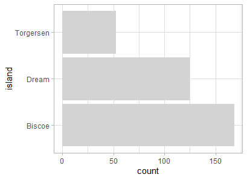

Simple R tricks to improve human perception of differences

## How many penguins are on each island?

Let's use {palmerpenguins} and analyse the number of penguins on each island.

```R
# packages
library(tidyverse)
library(explore)
library(palmerpenguins)
```

### Count it!

A simple way to answer this question ist to use ```count()```

```R
penguins %>% count(island)
```
```
# A tibble: 3 x 2
  island        n
  <fct>     <int>
1 Biscoe      168
2 Dream       124
3 Torgersen    52
```
Just looking to the number, we can easily find out that most of the penguins are living on the Biscoe island. 
But it is hard to get an accurate feeling of the differences between these numbers. 

### Add percentage!

Adding percentage helps a log. We can do that by using ```count_pct``` from {explore}

```R
penguins %>% count_pct(island)
```
```
# A tibble: 3 x 4
  island        n total   pct
  <fct>     <int> <int> <dbl>
1 Biscoe      168   344  48.8
2 Dream       124   344  36.0
3 Torgersen    52   344  15.1
```

Now we can see that 168 of 344 penguins are living on Biscoe island. The percentage is 48.8, so that is almost the half of the penguins.
We got a much clearer view on the data. 

The count_pct function is quite simple:

```R
count_pct <- function(data, ...)  {
  d <- data %>%
    dplyr::count(...)
  d <- d %>%
    dplyr::mutate(total = sum(n),
                  pct = n / sum(n) * 100.00)
  d
} 
```

But we can still improve it!


### Visualise it!

Cognitive studies proved that people can understand visualisations better and faster than just values (individuals used around 20% less cognitive resources. In other words, their brains were working a lot less hard) (Ref: https://www.bbc.com/news/business-17682294).

We can use barcharts to visualise the number of penguins on each island, as it is very easy for humans to compare the length of objects (like the length of bars).
{explore} offers a simple way to create bar plots:

```R
penguins %>% 
  explore(island)
```


By just looking to the bars, we instantly get a good understanding of the differences between the islands!

Of course you could use ggplot2 to build an individual plot:

```R
penguins %>% 
  count_pct(island) %>% 
    ggplot(aes(island, pct)) + 
    geom_col(fill = "grey") +
    geom_text(aes(y=pct, label=paste0(round(pct,1),"%")), 
              hjust=1, size=3) +
    coord_flip() +
    theme_light()
```


