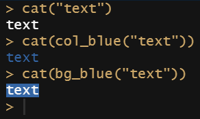

Writing Retro Games that run in the R Console

## Is it even possible?

R is a great language for doing statistics and data science, but it is not designed to develop games. So obviously writing games in R is just a fun project. 
During the corona-lockdown I had a lot of time and started getting interested in this topic. I found out, that there are some games written in R that are running in the R console:

* [The Secret of Landusia](https://lucidmanager.org/data-science/text-adventure/) - A Text Adventure in the R Language
* [Tenliner Cave Adventure](https://lucidmanager.org/data-science/tenliner-cave-adventure/) - Miniature Text Adventure Ported From the ZX81
* [{tictactoe}](https://cran.r-project.org/package=tictactoe) - tic-tac-toe game to play on console, either with human or AI players
* [{twenty48}](https://cran.r-project.org/package=twenty48) - Join the numbers and get to the 2048 tile!
* [Hangman](https://sites.google.com/site/marekhlavac/computer-games-written-in-r) - Classic Hangman Game

Other games uses the plot-window like [{fun}](https://cran.r-project.org/package=fun) and [{Snake}](https://cran.r-project.org/web/packages/Snake/index.html). I found R games that run in shiny like [Hangman](https://smirnovayu.shinyapps.io/hangman_en/) and [pong](https://chasemc.shinyapps.io/PONG/). Even running HTML-games in the RStudio-viewer is an option (see [here](https://github.com/RLesur/Rcade))

Peter Prevos wrote a great [summary article](https://lucidmanager.org/data-science/games-in-r/).

So, yes it is possible to write games in R!

## Text Input / Output

Base R provides functions for reading a line and writing text to the console.

```R
name <- readline("your name = ")
cat("Hello ", name)
```

So, thats probably all you need to write a text adventure. But I wanted to add at least some color and some sound.

## Color

To get some color output in the console, I used the package {cli}. You can select the foreground-color using col_{color}() and the background-color using bg_{color}().

```R
library(cli)
cat("text")
cat(col_blue("text"))
cat(bg_blue("text"))
```



So I was able to write a function, that displays a very basic "sprite" by using a space (" ") and setting a background color. The sprite is defined as text 
with letters representing the color (e.g. R = red)

```R
library(cli);

sprite_show <- function(txt)  {
  for (i in seq_len(nchar(txt))) {
    char <- substr(txt, i, i)
    if(char == "R") {cat(bg_red(" "))}
    if(char == "B") {cat(bg_blue(" "))}
    if(char == "C") {cat(bg_cyan(" "))}
    if(char == "G") {cat(bg_green(" "))}
    if(char == "M") {cat(bg_magenta(" "))}
    if(char == "Y") {cat(bg_yellow(" "))}
    if(char == "W") {cat(bg_white(" "))}
    if(char == "X") {cat(bg_black(" "))}
    if(char == ".") {cat(" ")}
    if(!char %in% c("R","B","C","G","M","Y","W","Y","W","X",".")) {cat(char)}
  }   
} # sprite_show() 
```

Now I can "draw" a golden key in the R console!

```R
txt <- paste0(
    "..............YYYY.", "\n",
    ".............YY..YY", "\n",
    "...YYYYYYYYYYYY..YY", "\n",
    "...Y.Y.......YY..YY", "\n",
    "...Y.Y........YYYY.", "\n")
  
sprite_show(txt)
```


## Sound

I found the package {beepr} that enables R to play some nice sounds that can be used for games.

```R
library(beepr)
beep("mario")
```

These two lines of code play the "super mario" sound.

## Codebreaker

So I got all I needed and was ready to create my own Retro-Game running in the R console!

I decided to write a game that is inspired by ["Mastermind"](https://www.archimedes-lab.org/mastermind.html), a game that became popular in the 1970s.


You are a codebreaker and play against the computer who is the codemaker. The computer chooses a pattern of four colors (duplicates possible). You try to break the code by trying color patterns. The computer tells you the number of correct colors. Try to break the code in less steps as possible! There are 3 game-modes: Single Game, Race and Xtreme.

You find the package on [CRAN](https://cran.r-project.org/package=codebreaker) and on [Github](https://github.com/rolkra/codebreaker).

Have fun!
