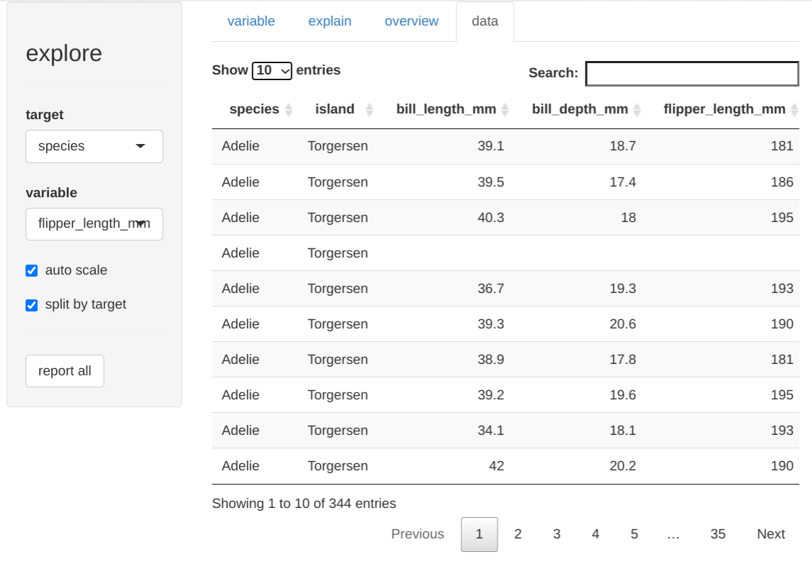
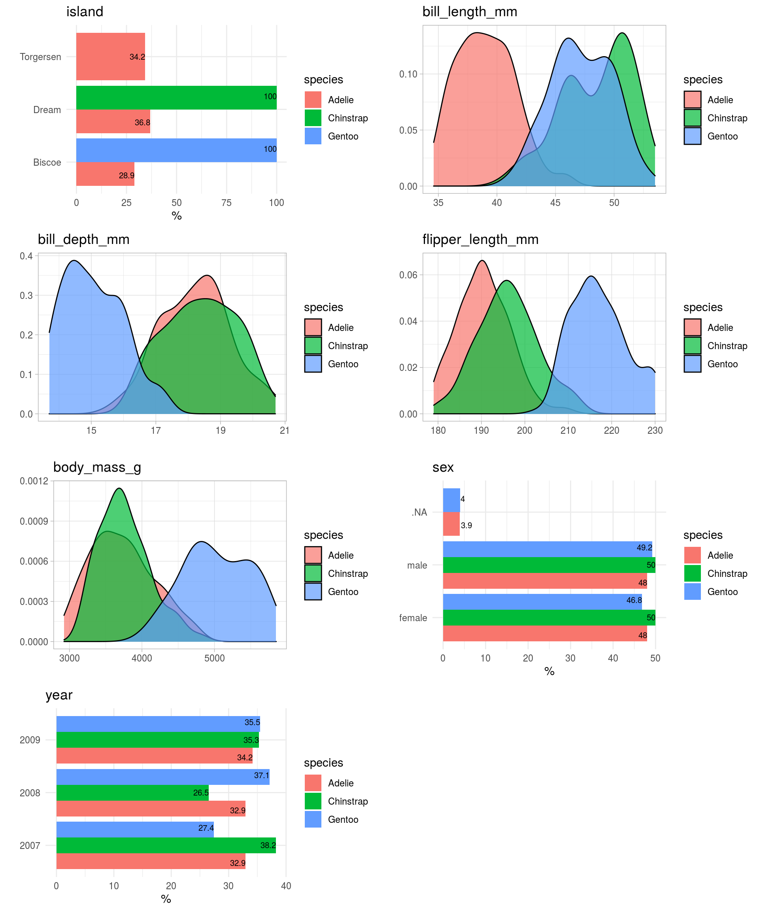

What if exploring data in R is just one line of code?

```R
explore(data)
```

**R would be so much more attractive to people that are used to do data analytics with Excel or a GUI based statistic tool!**

I really apprechiate the power of coding, but for fresh new R users stepping into coding is not easy. If you start RStudio for the first time, there is not much you can do by just "playing around". You may be able to import a dataset by using the "Import Dataset" button at the Environment pane. But then if you want to do some basic statistics or create some basic plots, you fail because the IDE is not offering any direct support. 


In a typical introduction to data exploration in R for beginners, you are confronted with more than 25 function names:

```library()```, ```getwd()```, ```setwd()```, ```c()```, ```data()```, ```data.frame()```, ```read.csv()```, ```str()```, ```head()```, ```tail()```, ```summary()```, ```table()```, ```ggplot()```, ```aes()```, ```geom_point()```, ```geom_bar()```, ```geom_boxplot()```, ```geom_density()```, ```coord_flip()```, ```labs()```, ```theme_light()```, ```select()```, ```filter()```, ```mutate()```, ```summarize()```, ```group_by()```, ```arrange()```, ...

But cognitive psychology proved, that humans can only keep about 7 new objects in memory ([The magical number 7, by George A. Miller](https://en.wikipedia.org/wiki/The_Magical_Number_Seven,_Plus_or_Minus_Two))
So you are not able to do the very basic stuff without learning quite a number of different concepts and functions the hard way first. That may be frustrating and feels like a "step backwards". 

**I believe using R for the first time should feel like getting new exciting toys you instantly want to use and play with**. 

Thats why I wrote the {explore} package! 

## Interactive Data Science

For example, to explore the penguins dataset you just need 3 easy to understand lines of code: 

```R
library(palmerpenguins)
library(explore)
explore(penguins)
```

This will launch a Shiny App that enables you to explore data with just a few mouse clicks!

The **variable tab** lets you explore a variable and its relation to a target 


The **explain tab** shows a decision tree explaining the target 


The **overview tab** describes all variables, their type, NA-values, min, max ...


The **data tab** view the raw data


## Automated Reports

Furthermore you can create different types of rich HTML-reports of your data by clicking the "report all" button.

If no target is defined, you get a report of all the variables


If a target is defined, you get a report of the relation between all variables and the target.


## Reproducible Data Science

Of course you can unleash the full power of R only using code, so the {explore} package offers all functionality of the GUI as extremely easy to use R functions to step into coding:
```explore()```, ```describe()```, ```report()```, ```explain_tree()```, ...

After a while these new R users will naturally go into the direction of reproducible datascience with rmarkdown and will discover new packages like {dplyr}, {ggplot2}, {tidyr}, ...

**So I believe the {explore} package offers an easy learning path, specially for people coming from a GUI, to have a successful start with R and stay with it in the long run.**

Let’s explore!
<https://github.com/rolkra/explore>

