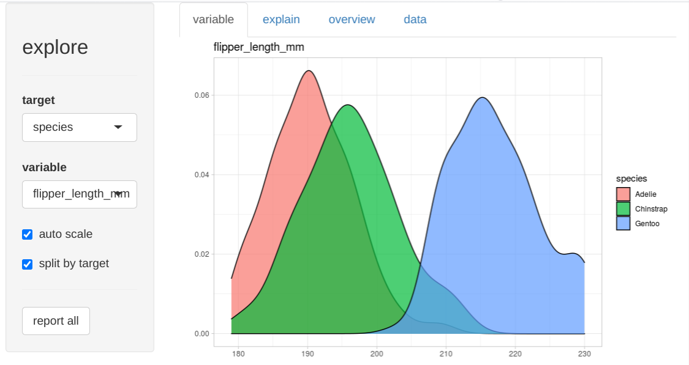
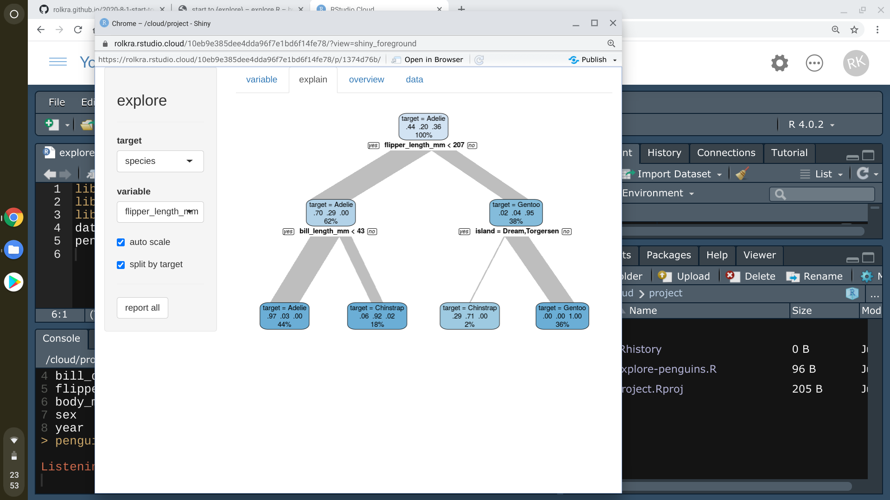
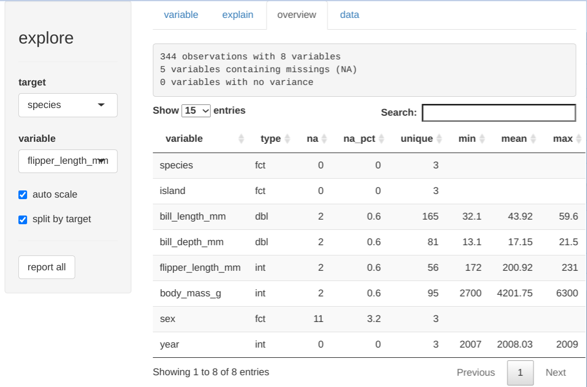

What if exploring data in R is just one line of code?

```R
explore(data)
```

**R would be so much more attractive to people that are used to do data analytics with Excel or a statistic tool with a GUI!**

I really apprechiate the power of coding, but for fresh new R user starting to code is not easy. If you start RStudio for the first time, there is not much you can do by just "playing around". You may be able to import a dataset by using the "Import Dataset" button at the Environment pane. But then if you want to do some basic statistics or create some plots, you fail because the IDE is not offering any support. 


In a typical introduction to data exploration in R for beginner, you are confronted with more than 25 function names:

```library```, ```getwd```, ```setwd```, ```c```, ```data```, ```data.frame```, ```read.csv```, ```str```, ```head```, ```tail```, ```summary```, ```table```, ```ggplot```, ```aes```, ```geom_point```, ```geom_bar```, ```geom_boxplot```, ```geom_density```, ```coord_flip```, ```labs```, ```theme_light```, ```select```, ```filter```, ```mutate```, ```summarize```, ```group_by```, ```arrange```, ...

So you are not able to do the very basic stuff without learning quite a number of different concepts and functions first. That may be frustrating and feels like a "step backwards". 

**I believe using R for the first time should feel like getting new exciting toys you instantly want to use and play with**. 

Thats why I wrote the {explore} package! 

For example, to explore the penguins dataset you just need 3 easy to understand lines of code: 

```R
library(palmerpenguins)
library(explore)
explore(penguins)
```







Let’s explore!
<https://github.com/rolkra/explore>

