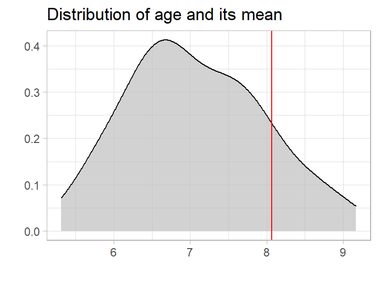

Averages are very common to use. Almost everyone is using them. But can we trust an average?

## What is an average?

In daily life we use “average” as a single number taken as representative of a list of numbers. In mathematics they are often called “mean”.
The mathematical definition of average (mean) is:

**average = the sum of the values / the number of values**

## 50 people in a bus


Let’s start with an example: There are 50 people in a bus. Let’s assume they are kids, and most of them are in the age between 6 and 8.

```R
set.seed(123)  # to make it reproducible
people <- data.frame(age = rnorm(50, mean = 7, sd = 1))
```
To explore the data we are using {tidyverse} and {explore}

```R
library(tidyverse)
library(explore)
```

To calculate the average age of the people we can use the describe() function of {explore}.

```R
people %>% describe(age)
```
```
## variable = age
## type     = double
## na       = 0 of 50 (0%)
## unique   = 50
## min|max  = 5.033383 | 9.168956
## q05|q95  = 5.734754 | 8.644704
## q25|q75  = 6.440683 | 7.698177
## median   = 6.9
## mean     = 7.034404
```

So the average age (mean) is 7 years. We can plot the age distribution using explore()

```R
people %>% 
  explore(age, title = "Distribution of age and its mean") +
  geom_vline(xintercept = 7.03, color = "red")
```


So if you tell someone that there is a bus arriving with 50 people 7 year old in average, they will think of 50 kids about 7 years old. And thats pretty ok. Even if the kids are actually between 5 and 9 years old, one single number (the average) helps to understand the whole group of people. Awesome!

## The bus driver!

But wait! We forgot the bus driver. Let’s say he is 60 years old. How does that change the average?

```R
people <- people %>% add_row(age = 60)
people %>% describe(age)
```
```
## variable = age
## type     = double
## na       = 0 of 51 (0%)
## unique   = 51
## min|max  = 5.033383 | 60
## q05|q95  = 5.734771 | 8.750989
## q25|q75  = 6.441842 | 7.740661
## median   = 6.9
## mean     = 8.072945
```

The average (mean) is increasing from 7 to 8 years. So the average is still useful, as almost all people in the bus are at least kids and the age of 8 years may be a useful orientation. But we may completely miss that there is an adult in the bus.

If we take a look to the distribution we see that the average is moving too much to the right" to be representative for the people.

```R
people %>% 
  explore(age, title = "Distribution of age and its mean") +
  geom_vline(xintercept = 8.07, color = "red")
```



## The bug!

But what happens if we don’t have clean data, and we add a person with age 5000? That could happen by mistyping (instead of age 50.00 by missing the “.” )

```R
people <- people %>% add_row(age = 5000)
people %>% describe(age)
```
```
## variable = age
## type     = double
## na       = 0 of 52 (0%)
## unique   = 52
## min|max  = 5.033383 | 5 000
## q05|q95  = 5.734788 | 8.958832
## q25|q75  = 6.443 | 7.790369
## median   = 7
## mean     = 104.0715
```

Just knowing the average age of these people, we expect a group of over 100 year old! Now we have the situation that the average is completely useless. Non of the real people is even close to 100 years old!

## Conclusion

**Never trust an average!**

One single extreme value can “destroy” the value of an average. If you base important decisions just on averages, there is high danger of failing. Use median instead or take a look at the real distribution!

