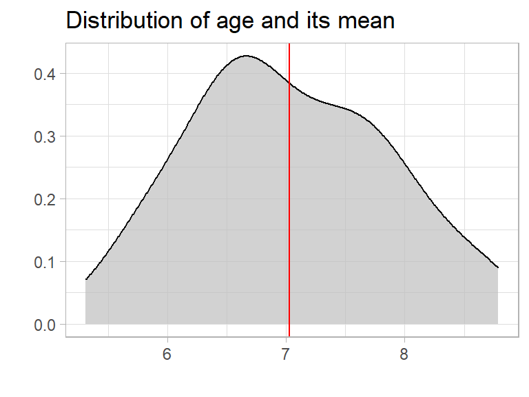

Averages are very common to use. Almost everyone is using them. But can we trust an average?

## What is an average?

In daily life we use “average” as a single number taken as representative of a list of numbers. In mathematics they are often called “mean”.
The mathematical definition of average (mean) is:

**average = the sum of the values / the number of values**

## 50 people in a bus
Let’s start with an example: There are 50 people in a bus. Let’s assume they are kids, and most of them are in the age between 6 and 8.

```R
set.seed(123)  # to make it reproducible
people <- data.frame(age = rnorm(50, mean = 7, sd = 1))
```
To explore the data we are using {tidyverse} and {explore}

```R
library(tidyverse)
library(explore)
```

To calculate the average age of the people we can use the describe() function of {explore}.

```R
people %>% describe(age)
```
```
## variable = age
## type     = double
## na       = 0 of 50 (0%)
## unique   = 50
## min|max  = 5.033383 | 9.168956
## q05|q95  = 5.734754 | 8.644704
## q25|q75  = 6.440683 | 7.698177
## median   = 6.9
## mean     = 7.034404
```

So the average age (mean) is 7 years. We can plot the age distribution using explore()

```R
people %>% 
  explore(age, title = "Distribution of age and its mean") +
  geom_vline(xintercept = 7.03, color = "red")
```


