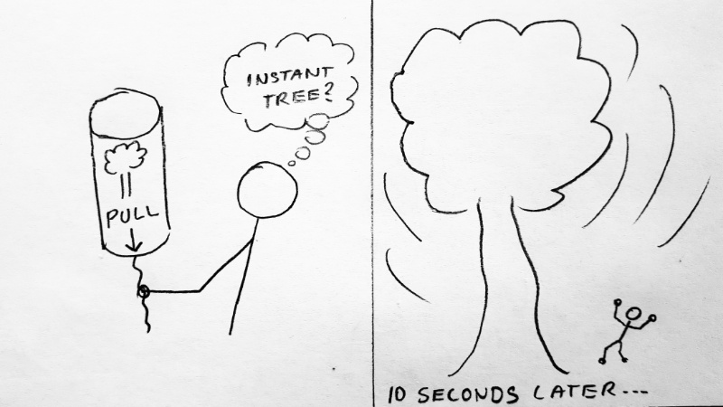
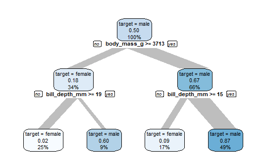
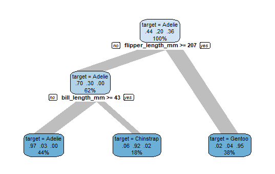
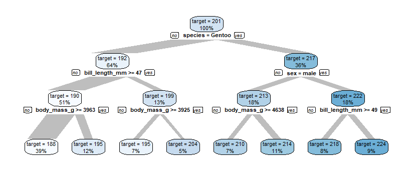
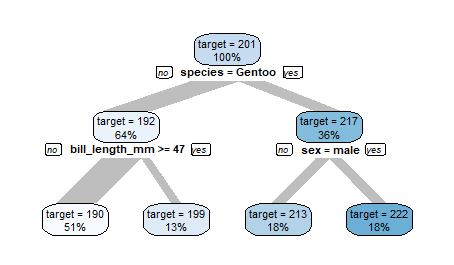
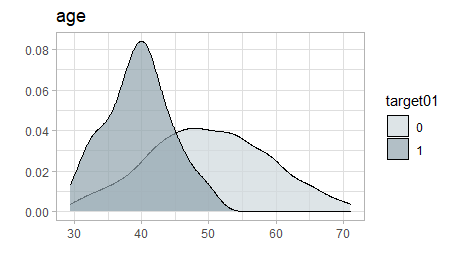
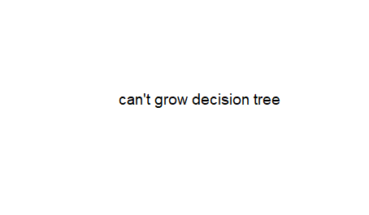
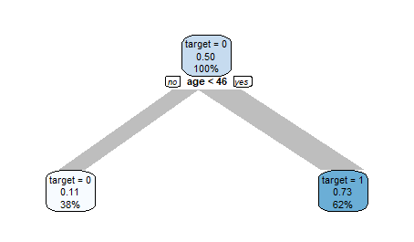

The fast way to create and visualise Decision Trees using {explore}  

## Decision Trees

Decision Trees are an "old" machine learning method to create a model that predicts the value of a target variable based on several input variables. The big advantage of Decision Trees is, that the result is easy to understand for humans!

The most popular package to create Decision Trees in R is {rpart}. For visualisation of trees {rpart.plot} is frequently used.


## Growing Trees
### The hard way


Using {rpart} and {rpart.plot} can be timeconsuming, as there are a lot of different parameters to set and the code for using a categorical target differs from using a numeric target. So instead of growing a tree fast, you end up in searching for code syntax in the help-files or searching the web.

### The easy way



{explore} offers a simple function to grow and visualise a Decision Tree without thinking about code syntax. 

In this example we will use the following packages

```R
library(dplyr)
library(explore)
library(palmerpenguins)
```

We use the penguins dataset from {palmerpenguins} to create Decision Trees. In this dataset each observation (row) is a penguin. We will filter out penguins with undefined bill length. Available variables (columns):

```R
data <- penguins %>% filter(bill_length_mm > 0) 
data %>% describe()
```

```
# A tibble: 8 x 8
  variable          type     na na_pct unique    min   mean    max
  <chr>             <chr> <int>  <dbl>  <int>  <dbl>  <dbl>  <dbl>
1 species           fct       0    0        3   NA     NA     NA  
2 island            fct       0    0        3   NA     NA     NA  
3 bill_length_mm    dbl       2    0.6    165   32.1   43.9   59.6
4 bill_depth_mm     dbl       2    0.6     81   13.1   17.2   21.5
5 flipper_length_mm int       2    0.6     56  172    201.   231  
6 body_mass_g       int       2    0.6     95 2700   4202.  6300  
7 sex               fct      11    3.2      3   NA     NA     NA  
8 year              int       0    0        3 2007   2008.  2009 
```

#### Binary target

The variable sex is binary, it has two different values (male/female).
Creating a Decision Tree explaining the sex-variable (is a penguin male?) is just this line of code:

```R
data %>% explain_tree(target = sex)
```



The top node contains all penguins. Meaning of the labels:

* "target = male": class of target with at least 50%
* 0.50 is the proportion of male in this node
* This node contains 100% of all penguins in the data 

Now the algorithm is searching how to split this node into 2 groups with highest possible difference in males. If body_mass_g >= 3713 there are 67% male (so the majority is male), in the group body_mass_g < 3713 there are only 18% male (so the majority is female).

These groups can be split again in two subgroups with high difference in males. So in the end we get 4 groups, 2 with high proportion of males and 2 with high proportion of females. The biggest group is the node on the bottom right, it contains 49% of all penguins.

#### Categorical target

The variable species is categorical, it has 3 different values. To create a Decision Tree explaining the species-variable (Adelie/Chinstrap/Gentoo) we just need to replace sex with species.

```R
data %>% explain_tree(target = species)
```



The top node contains 44% Adelie, 20% Chinstrap and 36% Gentoo penguins. As Adelie have the highest proportion, this node is labeled "target = Adelie". Using flipper_length_mm and bill_length_mm to split into subgroups, we finally get 3 groups seperating the penguins by species with high probability.

#### Numerical target

The variable flipper_length_mm is numerical, it has values between 172 and 231. To create a Decision Tree explaining the flipper_length_mm-variable we just need to pass flipper_length_mm as target.

```R
data %>% explain_tree(target = flipper_length_mm)
```



The top node contains all penguins, they have an average flipper_length_mm of 201. Using different variables for splitting into subgroups, we finally get 8 groups of penguins with average flipper_length_mm from 188 to 224

### Advanced

#### Control tree size

You can control the tree size using the maxdepth parameter.

```R
data %>% 
  explain_tree(target = flipper_length_mm,
               maxdepth = 2)
```



You may also use parameter minsplit to control the tree.

#### Inbalanced target

If your data contains a binary target (0/1) that is highly inbalanced (rare target = 1 values), it might be useful to weight the target. Otherwise {rpart} is not able to create a Decision Tree.

Let's create a highly inbalanced dataset:

```R
data <- data.frame(
  target01 = sample(
      c(0,1), 1000, replace = TRUE, 
      prob = c(0.95,0.05))
  )

data$age = ifelse(data$target01 == 1,
                  rnorm(1000, mean = 40, sd = 5),
                  rnorm(1000, mean = 50, sd = 10))
```

There is a clear pattern in the data:

```R
data %>% explore(age, target = target01)
```



But growing a tree fails.

```R
data %>% explain_tree(target = target01)
```



There are not enough target01 = 1 in the data to create the tree:

```R
data %>% describe(target01)
```

```
variable = target01
type     = double
na       = 0 of 1 000 (0%)
unique   = 2
       0 = 953 (95.3%)
       1 = 47 (4.7%)
```

Weighting the target will help:

```R
weights <- weight_target(data, target01)
data %>% 
  explain_tree(target = target01, 
               weights = weights)
```



The Decision Tree now can detect the pattern in the data easily.
