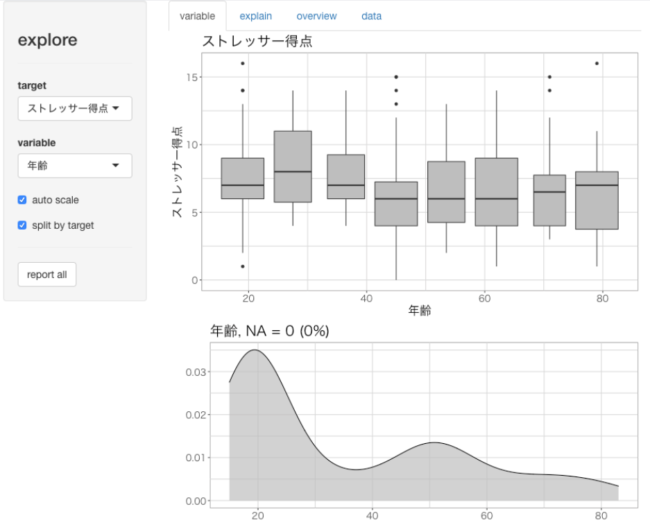
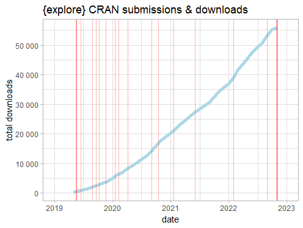

I am excited to announce the release of {explore} 1.0.0!

{explore} simplifies exploratory data analysis!

```R
library(explore)
create_data_app(obs = 200) |> 
  explore()
```


Time to look back:

## The beginning

In 2018 I was working as a Data Scientist for a big telecommunication company. I was writing a lot of R code for exploratory data analysis (EDA). I really loved R as a programming language, but it felt somehow wrong. I was spending so much time writing code, searching for the correct syntax in help files and on the web. My brain was blocked by these things. It was like trying to write a poem, but thinking way too much about grammar.  

There must be a better way.

I started inspecting the code I wrote for EDA. And there was so much repetition. It's time to pack some of this code into function! After a while I collected quite a number of useful functions and found out that putting these functions into an R package isn't as complicated as I thought.

## Start sharing

So I created my first R package with myself as the only user.

After a while some of my colleagues were getting interested in the package (it was not called {explore} at this time), so I decided to share the package within the company. Now I started to understand the benefit of writing R packages. My code helped others to do EDA much faster, and I got a lot of useful feedback.

## Go CRAN

After a while I realized that this package could help people outside of my company too. I started to inform myself if I as an employee was allowed to share R code as open source. It was difficult to get an answer, because I was the first to ask this question.

Luckily I got a “go” after a while and I started working on the CRAN package.

### Choosing a name

And I needed a package-name. I did a brainstorming and came up with:
* deexr (de)scribe - (ex)plore (r)eport
* fastEDA
* edaR
* exploreR (which was already the name of an existing packages)
* explore

I was surprised that “explore” was still available. But I was unsure if I am even allowed to pick such a general name for my first package. But then I decided to be brave and choose {explore}!
 
### Following the rules 

My first submission to CRAN was a disaster. I was overwhelmed by warnings, errors and complaints not following CRAN rules.

```
…does not pass the incoming checks automatically
```

I was really surprised how strict these rules are. Even a simple misspelling of a word in the DESCRIPTION file was not acceptable.

After my package was rejected (again) with the following message:

```
Thanks, we see:

         Possibly mis-spelled words in DESCRIPTION:
         grafically
```

 I was really thinking of giving up.

Luckily I was finally able to fix all the problems and {explore} hit CRAN on May 2019!

### Hex sticker

Finally the package needed a hex sticker. Luckily {hexSticker} helped a lot:


## Getting attention

I was surprised to find {explore} beeing covered in a paper:

The Landscape of R Packages for Automated Exploratory Data Analysis (by Mateusz Staniak and Przemysław Biecek)
<https://arxiv.org/pdf/1904.02101.pdf>

*"...a systematic review of existing tools for Automated Exploratory Data Analysis (autoEDA). We explore
the features of fifteen popular R packages to identify the parts of the analysis that can be effectively
automated with the current tools and to point out new directions for further autoEDA development."*


Furthermore the paper was presented at the Why R? 2019 conference in Wrocław, Poland

Sometimes I was getting contacted by other {explore} users. I really loved these conversations, especially with people from Africa.

## Improving

I started getting more used to CRAN and its rules and was able to slowly improve {explore}

What I loved most was to get feedback from other users. The most surprising one was a user that asked to support Japanese Fonts in Data-Column names:

```
explore(PatientStress,ID,ストレッサー得点) 
```

I was impressed that {explore} is used in Japan for medical analysis and so I decided to fulfill this wish.



## Teaching

I found out that {explore} helps a lot to get people into R. Instead of learning a bunch of functions-names before doing anything useful, you can just start as simple as this:

```R
library(explore)
data <- create_data_app()
expore(data)
```

This will start a shiny app that let's you do interactive data exploration.

To get more options and possibilities these new R users will switch to coding using just a handful of simple functions of the {explore} package. After a while they  will naturally go into the direction of reproducible data science with rmarkdown/quarto and will discover new packages like {dplyr}, {ggplot2}, {tidyr}

So I believe the {explore} package offers an easy learning path, specially for people coming from a GUI, to have a successful start with R and stay with it in the long run.

To support teaching I always wanted to record a "hands-on" video of {explore} and put it on YouTube, but didn't find the time. But luckily, someone else did it:

<https://www.youtube.com/watch?v=j1pkPsjYw5s&t=61s>


Thanks a lot!

## Version 1.0.0

So 3 ½ years after putting the first version on CRAN (and 16 updates/submissions), I now finalized version 1.0.0.



Enjoy!
