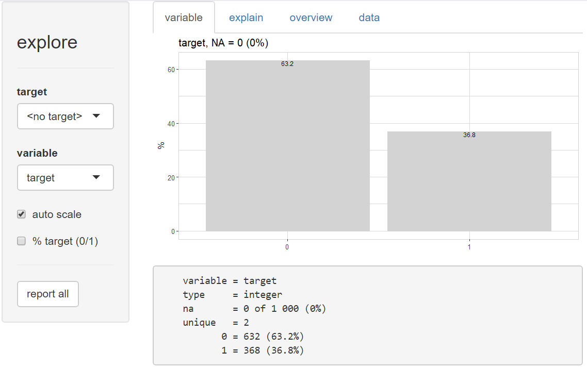
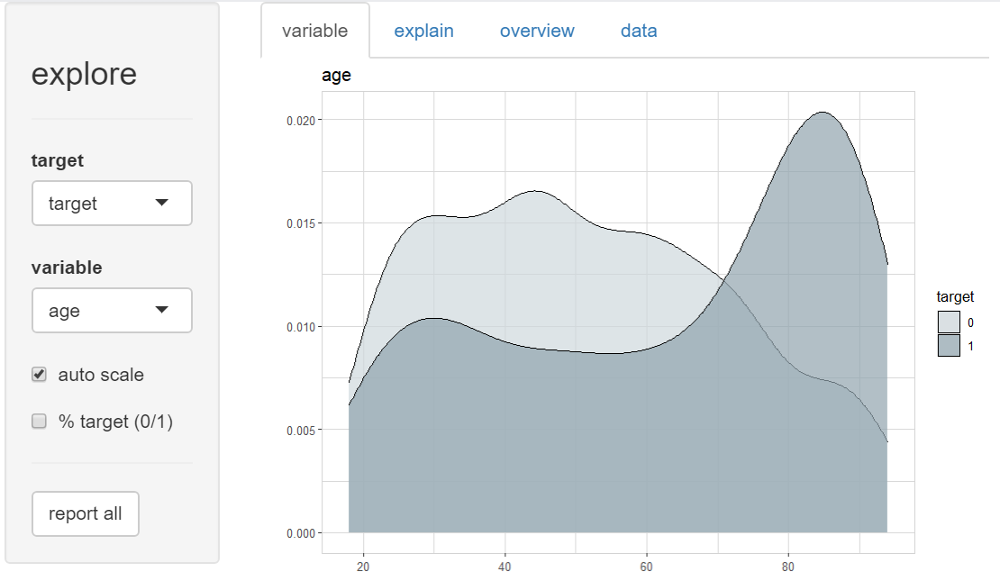
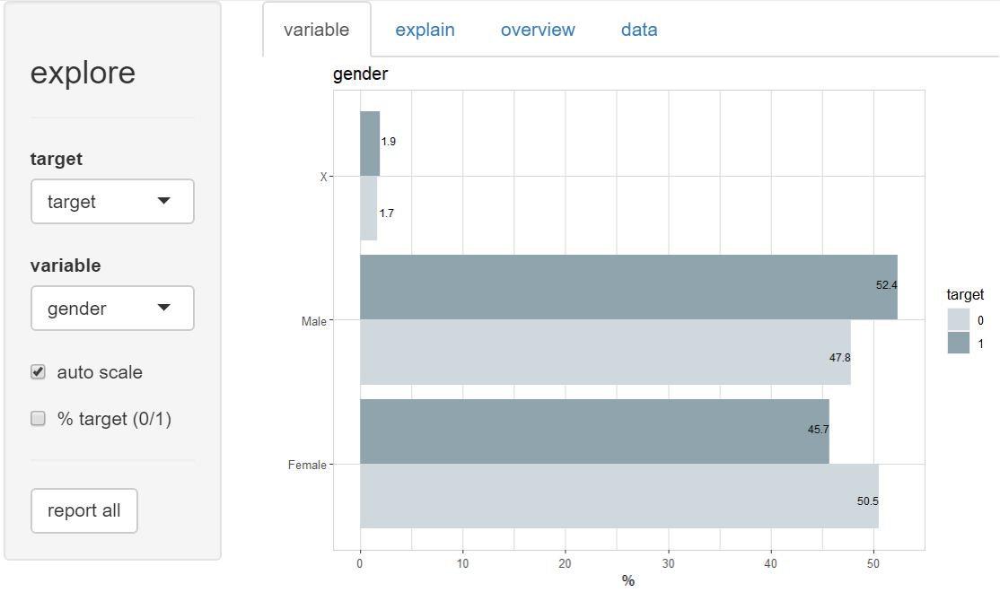
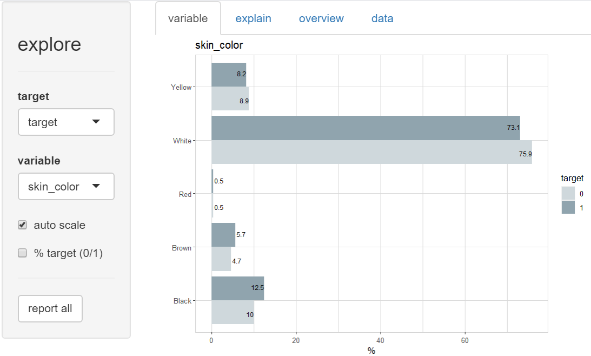
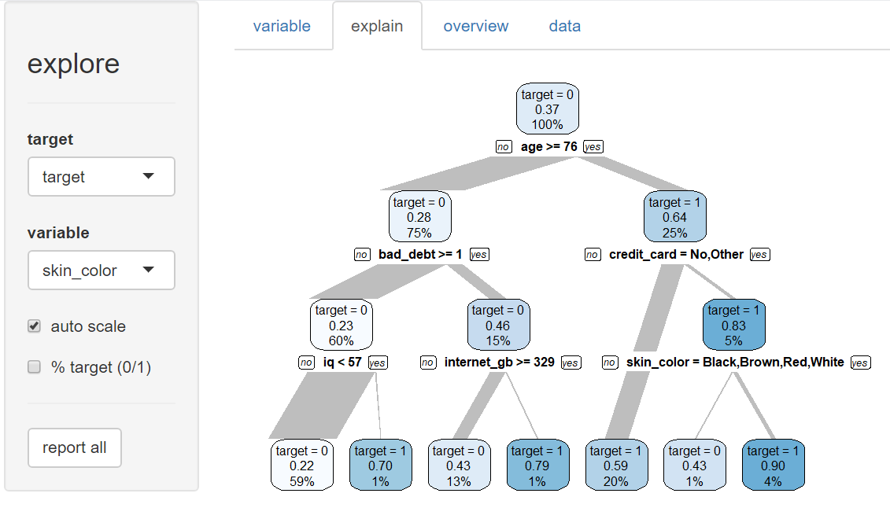

The best way to learn how to get an fair AI is ... <br>
Train an unfair AI and try to detect its unfairness!

## Get data

To train an unfair AI you need data containing sensitive features. 
As this is critical from a privacy perspective, use synthetic data!

You may create your own training data manually using {explore} (you need version 1.0.1 or higher):

```R
library(explore)
train <- create_data_unfair(obs = 1000, seed = 10)
```
Now let's describe the data:

```R
describe(train)
```

```
# A tibble: 22 x 8
   variable    type     na na_pct unique   min   mean   max
   <chr>       <chr> <int>  <dbl>  <int> <dbl>  <dbl> <dbl>
 1 age         int       0      0     80  16    55.4   95  
 2 gender      chr       0      0      3  NA    NA     NA  
 3 eye_color   chr       0      0      3  NA    NA     NA  
 4 shoe_size   dbl       0      0     39  30.2  41.8   52.2
 5 iq          dbl       0      0    110  37    99.3  173  
 6 education   int       0      0    101   0    50.0  100  
 7 income      dbl       0      0    220   0    62.5  143  
 8 handset     chr       0      0      3  NA    NA     NA  
 9 pet         chr       0      0      4  NA    NA     NA  
10 smoking     dbl       0      0      2   0     0.29   1  
11 name_arabic int       0      0      2   0     0.12   1  
12 outfit      chr       0      0      3  NA    NA     NA  
13 glasses     dbl       0      0      2   0     0.34   1  
14 tatoos      dbl       0      0      2   0     0.19   1  
15 kids        dbl       0      0      2   0     0.5    1  
16 bad_debt    dbl       0      0      3   0     0.24   2  
17 credit_card chr       0      0      4  NA    NA     NA  
18 left_handed dbl       0      0      2   0     0.21   1  
19 skin_color  chr       0      0      5  NA    NA     NA  
20 religion    chr       0      0      4  NA    NA     NA  
21 internet_gb dbl       0      0    666   0   118.   442. 
22 target      int       0      0      2   0     0.37   1 
```

In this dataset we find a lot of sensitive features (gender, skin_color, iq, income, religion, ...) together with a target variable (target)
Let's think of an website offering credits, and we wants to predict if a customer gets payment difficulties (target = 1)

## Find patterns

We start the {explore} GUI

```R
explore(train)
```



So, about 37% of all people in the dataset had payment difficulties (target = 1)

To explore the relationship between age and the target, we select variable "target" as target, and age as variable.



Wee see, that older people have more frequent payment difficulties. An AI model that uses this data will learn that older people are more risky and decide frequently against older people. Is this fair? Probably yes, if there is a real reason behind this pattern. But probably no, because descisions bases on age may simply discriminate older people.

There are a lot of other sensitive variables in the dataset!






Which of these pattern will a AI model "pick up" during training?

## AI Model

A simple AI Model (Decision Tree) would learn this:


