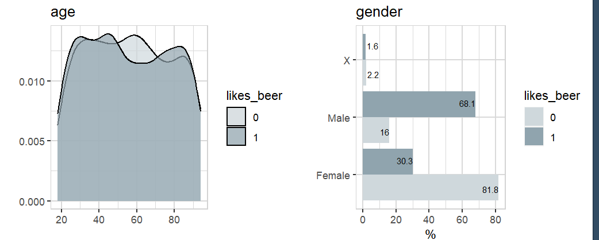

You need sample data for learning/testing/teaching?<br> 
Create your own ... using {explore}

The R package {explore} offers prepared synthetic data. You can use ```create_data_*()``` functions to create this synthetic data.
The number of observations can be controlled by parameter ```obs```. If you want to create reproducible synthetic data, use parameter ```seed``` (random seed number)

## Person

```create_data_person()``` creates a dataset containing synthetic data of people:

```R
library(explore)
data <- create_data_person(obs = 1000, seed = 10)
describe(data)
```
```
# A tibble: 15 x 8
   variable          type     na na_pct unique   min  mean   max
   <chr>             <chr> <int>  <dbl>  <int> <dbl> <dbl> <dbl>
 1 age               int       0      0     80  16   55.4   95  
 2 gender            chr       0      0      3  NA   NA     NA  
 3 eye_color         chr       0      0      3  NA   NA     NA  
 4 shoe_size         dbl       0      0     39  30.2 41.8   52.2
 5 iq                dbl       0      0    110  37   99.3  173  
 6 education         int       0      0    101   0   50.0  100  
 7 income            dbl       0      0    220   0   62.5  143  
 8 handset           chr       0      0      3  NA   NA     NA  
 9 pet               chr       0      0      4  NA   NA     NA  
10 favorite_pizza    chr       0      0      6  NA   NA     NA  
11 favorite_icecream chr       0      0      7  NA   NA     NA  
12 likes_garlic      int       0      0      2   0    0.6    1  
13 likes_sushi       int       0      0      2   0    0.32   1  
14 likes_beatles     int       0      0      2   0    0.5    1  
15 likes_beer        int       0      0      2   0    0.64   1  
```

We get a dataframe containing 1000 observations and 15 variables. Some of these variables have completely random values, some have build in correlations.

```R
data |> explore(age, target = likes_beer)
data |> explore(gender, target = likes_beer)
```



The pattern age/likes_beer is just a random noise, but gender/likes_beer is a build in correlation.

## App

```create_data_app()``` creates a dataset containing synthetic data of apps in an appstore:

```R
data <- create_data_app(obs = 1000, seed = 10)
describe(data)
```
```
# A tibble: 7 x 8
  variable     type     na na_pct unique   min    mean   max
  <chr>        <chr> <int>  <dbl>  <int> <dbl>   <dbl> <dbl>
1 os           chr       0      0      3    NA   NA       NA
2 free         dbl       0      0      2     0    0.6      1
3 downloads    int       0      0    968    72 6943.   23362
4 rating       dbl       0      0      5     1    3.39     5
5 type         chr       0      0     10    NA   NA       NA
6 updates      dbl       0      0    147     0   48.2    100
7 screen_sizes dbl       0      0      5     1    2.56     5
```

## Buy

```create_data_buy()``` creates a dataset containing synthetic data of customer who buy (or not buy) a product:

```R
data <- create_data_buy(obs = 1000, seed = 10)
describe(data)
```
```
# A tibble: 13 x 8
   variable        type     na na_pct unique    min      mean    max
   <chr>           <chr> <int>  <dbl>  <int>  <dbl>     <dbl>  <dbl>
 1 period          int       0      0      1 202012 202012    202012
 2 buy             int       0      0      2      0      0.5       1
 3 age             int       0      0     69     16     52.4      97
 4 city_ind        int       0      0      2      0      0.52      1
 5 female_ind      int       0      0      2      0      0.52      1
 6 fixedvoice_ind  int       0      0      2      0      0.1       1
 7 fixeddata_ind   int       0      0      1      1      1         1
 8 fixedtv_ind     int       0      0      2      0      0.41      1
 9 mobilevoice_ind int       0      0      2      0      0.6       1
10 mobiledata_ind  chr       0      0      3     NA     NA        NA
11 bbi_speed_ind   int       0      0      2      0      0.63      1
12 bbi_usg_gb      int       0      0     85      8    164.   100000
13 hh_single       int       0      0      2      0      0.31      1
```

## Churn

```create_data_churn()``` creates a dataset containing synthetic data of customer churn:

```R
data <- create_data_churn(obs = 1000, seed = 10)
describe(data)
```
```
# A tibble: 9 x 8
  variable   type     na na_pct unique   min  mean   max
  <chr>      <chr> <int>  <dbl>  <int> <dbl> <dbl> <dbl>
1 price      dbl       0      0     26     4 19.1     29
2 type       chr       0      0      3    NA NA       NA
3 usage      dbl       0      0    157     0 56.7    150
4 shared     dbl       0      0      2     0  0.37     1
5 device     chr       0      0      3    NA NA       NA
6 newsletter dbl       0      0      2     0  0.49     1
7 language   chr       0      0      4    NA NA       NA
8 duration   int       0      0    101     0 50.8    100
9 churn      dbl       0      0      2     0  0.36     1
```

## Unfair

```create_data_churn()``` creates a dataset containing synthetic data of people that can be used to test model fairness:

```R
data <- create_data_unfair(obs = 1000, seed = 10)
describe(data)
```
```
# A tibble: 22 x 8
   variable    type     na na_pct unique   min   mean   max
   <chr>       <chr> <int>  <dbl>  <int> <dbl>  <dbl> <dbl>
 1 age         int       0      0     80  16    55.4   95  
 2 gender      chr       0      0      3  NA    NA     NA  
 3 eye_color   chr       0      0      3  NA    NA     NA  
 4 shoe_size   dbl       0      0     39  30.2  41.8   52.2
 5 iq          dbl       0      0    110  37    99.3  173  
 6 education   int       0      0    101   0    50.0  100  
 7 income      dbl       0      0    220   0    62.5  143  
 8 handset     chr       0      0      3  NA    NA     NA  
 9 pet         chr       0      0      4  NA    NA     NA  
10 smoking     dbl       0      0      2   0     0.29   1  
11 name_arabic int       0      0      2   0     0.12   1  
12 outfit      chr       0      0      3  NA    NA     NA  
13 glasses     dbl       0      0      2   0     0.34   1  
14 tatoos      dbl       0      0      2   0     0.19   1  
15 kids        dbl       0      0      2   0     0.5    1  
16 bad_debt    dbl       0      0      3   0     0.24   2  
17 credit_card chr       0      0      4  NA    NA     NA  
18 left_handed dbl       0      0      2   0     0.21   1  
19 skin_color  chr       0      0      5  NA    NA     NA  
20 religion    chr       0      0      4  NA    NA     NA  
21 internet_gb dbl       0      0    666   0   118.   442. 
22 target      int       0      0      2   0     0.37   1  
```

## Random

```create_data_random()``` creates a dataset containing random data:

```R
data <- create_data_random(obs = 1000, vars = 10, seed = 10)
describe(data)
```
```
# A tibble: 12 x 8
   variable   type     na na_pct unique   min  mean   max
   <chr>      <chr> <int>  <dbl>  <int> <dbl> <dbl> <dbl>
 1 id         int       0      0   1000     1 500.   1000
 2 target_ind int       0      0      2     0   0.5     1
 3 var_1      int       0      0    101     0  49.5   100
 4 var_2      int       0      0    101     0  50.8   100
 5 var_3      int       0      0    101     0  50.5   100
 6 var_4      int       0      0    101     0  48.9   100
 7 var_5      int       0      0    101     0  51.1   100
 8 var_6      int       0      0    101     0  50.9   100
 9 var_7      int       0      0    101     0  49.7   100
10 var_8      int       0      0    101     0  49.2   100
11 var_9      int       0      0    101     0  49.2   100
12 var_10     int       0      0    101     0  50.1   100
```

## Empty

```create_data_random()``` creates an empty dataset. You can use ```add_var_random_*()``` functions to add random variables:

```R
data <- create_data_empty(obs = 100)
data <- data |> 
  add_var_random_01(name = "success", prob = c(0.3, 0.7)) |> 
  add_var_random_dbl(name = "budget", min_val = 10, max_val = 100) |> 
  add_var_random_cat(name = "group", cat = LETTERS[1:5])
head(data)
```
```
  success   budget group
1       1 85.71165     C
2       1 92.23001     D
3       0 14.32489     C
4       0 91.91952     E
5       0 65.75793     B
6       1 28.00104     D
```

You can add prepared random variables too:

```R
data <- data |> 
  add_var_random_starsign() |> 
  add_var_random_moon()
```
```
   success   budget group random_starsign  random_moon
1        1 85.71165     C             Leo Waning  (-) 
2        1 92.23001     D             Leo Waning  (-) 
3        0 14.32489     C           Aries Waning  (-) 
4        0 91.91952     E          Pisces Waxing  (+)
5        0 65.75793     B          Pisces Waning  (-) 
6        1 28.00104     D           Aries Waxing  (+)
7        0 17.92046     C           Virgo Waxing  (+)
8        1 16.59915     D           Libra Waning  (-) 
9        0 78.61641     C           Aries Waxing  (+)
10       0 15.86658     C          Taurus Waning  (-) 
11       0 12.72608     E          Pisces     New ( )   
12       0 71.91871     C             Leo Waning  (-) 
13       1 22.82367     E        Aquarius Waning  (-) 
14       1 19.63139     D       Carpicorn Waning  (-) 
15       1 38.01133     E       Carpicorn Waxing  (+)
```
