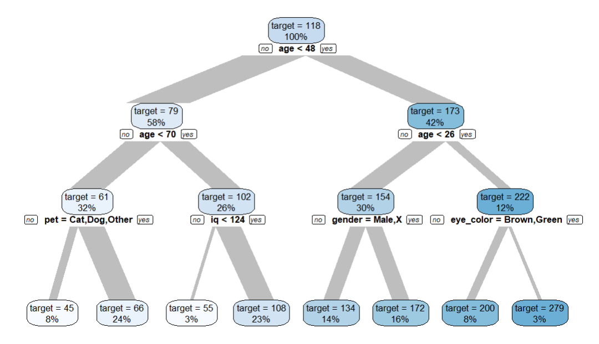
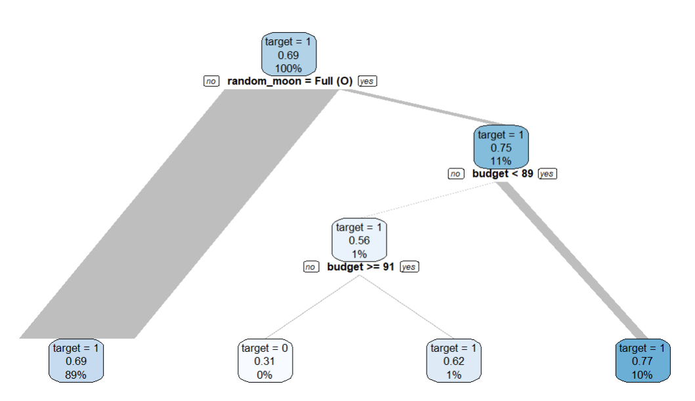

You need sample data for learning/testing/teaching?<br> 
Create your own ... using {explore}

The R package {explore} offers prepared synthetic data. You can use ```create_data_*()``` functions to create this synthetic data.
The number of observations can be controlled by parameter ```obs```. If you want to create reproducible synthetic data, use parameter ```seed``` (random seed number)

## Person

```create_data_person()``` creates a dataset containing synthetic data of people:

```R
library(explore)
data <- create_data_person(obs = 1000, seed = 10)
describe(data)
```

```
# A tibble: 15 x 8
   variable          type     na na_pct unique   min  mean   max
   <chr>             <chr> <int>  <dbl>  <int> <dbl> <dbl> <dbl>
 1 age               int       0      0     80  16   55.4   95  
 2 gender            chr       0      0      3  NA   NA     NA  
 3 eye_color         chr       0      0      3  NA   NA     NA  
 4 shoe_size         dbl       0      0     39  30.2 41.8   52.2
 5 iq                dbl       0      0    110  37   99.3  173  
 6 education         int       0      0    101   0   50.0  100  
 7 income            dbl       0      0    220   0   62.5  143  
 8 handset           chr       0      0      3  NA   NA     NA  
 9 pet               chr       0      0      4  NA   NA     NA  
10 favorite_pizza    chr       0      0      6  NA   NA     NA  
11 favorite_icecream chr       0      0      7  NA   NA     NA  
12 likes_garlic      int       0      0      2   0    0.6    1  
13 likes_sushi       int       0      0      2   0    0.32   1  
14 likes_beatles     int       0      0      2   0    0.5    1  
15 likes_beer        int       0      0      2   0    0.64   1  
```

We get a dataframe containing 1000 observations and 15 variables. Some of these variables have completely random values, some have build in correlations.

```R
data |> explore(age, target = likes_beer)
data |> explore(gender, target = likes_beer)
```


The pattern age/likes_beer is just a random noise, but gender/likes_beer is a build in correlation.

## App

```create_data_app()``` creates a dataset containing synthetic data of apps in an appstore:

```R
data <- create_data_app(obs = 1000, seed = 10)
describe(data)
```

```
# A tibble: 7 x 8
  variable     type     na na_pct unique   min    mean   max
  <chr>        <chr> <int>  <dbl>  <int> <dbl>   <dbl> <dbl>
1 os           chr       0      0      3    NA   NA       NA
2 free         dbl       0      0      2     0    0.6      1
3 downloads    int       0      0    968    72 6943.   23362
4 rating       dbl       0      0      5     1    3.39     5
5 type         chr       0      0     10    NA   NA       NA
6 updates      dbl       0      0    147     0   48.2    100
7 screen_sizes dbl       0      0      5     1    2.56     5
```

```R
data |> explore(downloads, target = os)
```


## Buy

```create_data_buy()``` creates a dataset containing synthetic data of customer who buy (or not buy) a product:

```R
data <- create_data_buy(obs = 1000, seed = 10)
describe(data)
```

```
# A tibble: 13 x 8
   variable        type     na na_pct unique    min      mean    max
   <chr>           <chr> <int>  <dbl>  <int>  <dbl>     <dbl>  <dbl>
 1 period          int       0      0      1 202012 202012    202012
 2 buy             int       0      0      2      0      0.5       1
 3 age             int       0      0     69     16     52.4      97
 4 city_ind        int       0      0      2      0      0.52      1
 5 female_ind      int       0      0      2      0      0.52      1
 6 fixedvoice_ind  int       0      0      2      0      0.1       1
 7 fixeddata_ind   int       0      0      1      1      1         1
 8 fixedtv_ind     int       0      0      2      0      0.41      1
 9 mobilevoice_ind int       0      0      2      0      0.6       1
10 bbi_speed_ind   int       0      0      2      0      0.63      1
11 bbi_usg_gb      int       0      0     85      8    164.   100000
12 hh_single       int       0      0      2      0      0.31      1
```

```R
data |> explain_tree(target = buy)
```


## Churn

```create_data_churn()``` creates a dataset containing synthetic data of customer churn:

```R
data <- create_data_churn(obs = 1000, seed = 10)
describe(data)
```

```
# A tibble: 9 x 8
  variable   type     na na_pct unique   min  mean   max
  <chr>      <chr> <int>  <dbl>  <int> <dbl> <dbl> <dbl>
1 price      dbl       0      0     26     4 19.1     29
2 type       chr       0      0      3    NA NA       NA
3 usage      dbl       0      0    157     0 56.7    150
4 shared     dbl       0      0      2     0  0.37     1
5 device     chr       0      0      3    NA NA       NA
6 newsletter dbl       0      0      2     0  0.49     1
7 language   chr       0      0      4    NA NA       NA
8 duration   int       0      0    101     0 50.8    100
9 churn      dbl       0      0      2     0  0.36     1
```

```R
data |> explain_tree(target = churn)
```


## Unfair

```create_data_churn()``` creates a dataset containing synthetic data of people that can be used to test model fairness:

```R
data <- create_data_unfair(obs = 1000, seed = 10)
describe(data)
```

```
# A tibble: 22 x 8
   variable    type     na na_pct unique   min   mean   max
   <chr>       <chr> <int>  <dbl>  <int> <dbl>  <dbl> <dbl>
 1 age         int       0      0     80  16    55.4   95  
 2 gender      chr       0      0      3  NA    NA     NA  
 3 eye_color   chr       0      0      3  NA    NA     NA  
 4 shoe_size   dbl       0      0     39  30.2  41.8   52.2
 5 iq          dbl       0      0    110  37    99.3  173  
 6 education   int       0      0    101   0    50.0  100  
 7 income      dbl       0      0    220   0    62.5  143  
 8 handset     chr       0      0      3  NA    NA     NA  
 9 pet         chr       0      0      4  NA    NA     NA  
10 smoking     dbl       0      0      2   0     0.29   1  
11 name_arabic int       0      0      2   0     0.12   1  
12 outfit      chr       0      0      3  NA    NA     NA  
13 glasses     dbl       0      0      2   0     0.34   1  
14 tatoos      dbl       0      0      2   0     0.19   1  
15 kids        dbl       0      0      2   0     0.5    1  
16 bad_debt    dbl       0      0      3   0     0.24   2  
17 credit_card chr       0      0      4  NA    NA     NA  
18 left_handed dbl       0      0      2   0     0.21   1  
19 skin_color  chr       0      0      5  NA    NA     NA  
20 religion    chr       0      0      4  NA    NA     NA  
21 internet_gb dbl       0      0    666   0   118.   442. 
```

```R
data |> explain_tree(target = internet_gb)
```



If we try to predict internet usage in gigabytes using all other variables in the dataset, we see some patterns. 
Some might make sense, some other might just cause unfairness and discrimination. This dataset is designed to be used as a educational playground 
for "Trustworthy AI".

## Random

```create_data_random()``` creates a dataset containing random data:

```R
data <- create_data_random(obs = 1000, vars = 10, seed = 10)
describe(data)
```

```
# A tibble: 12 x 8
   variable   type     na na_pct unique   min  mean   max
   <chr>      <chr> <int>  <dbl>  <int> <dbl> <dbl> <dbl>
 1 id         int       0      0   1000     1 500.   1000
 2 target_ind int       0      0      2     0   0.5     1
 3 var_1      int       0      0    101     0  49.5   100
 4 var_2      int       0      0    101     0  50.8   100
 5 var_3      int       0      0    101     0  50.5   100
 6 var_4      int       0      0    101     0  48.9   100
 7 var_5      int       0      0    101     0  51.1   100
 8 var_6      int       0      0    101     0  50.9   100
 9 var_7      int       0      0    101     0  49.7   100
10 var_8      int       0      0    101     0  49.2   100
11 var_9      int       0      0    101     0  49.2   100
12 var_10     int       0      0    101     0  50.1   100
```

## Empty

```create_data_empty()``` creates an empty dataset. You can use ```add_var_random_*()``` functions to add random variables:

```R
data <- create_data_empty(obs = 5000)
data <- data |> 
  add_var_random_01(name = "success", prob = c(0.3, 0.7), seed = 16) |> 
  add_var_random_dbl(name = "budget", min_val = 10, max_val = 100) |> 
  add_var_random_cat(name = "group", cat = LETTERS[1:5])
head(data)
```

```
  success   budget group
1       1 85.71165     C
2       1 92.23001     D
3       0 14.32489     C
4       0 91.91952     E
5       0 65.75793     B
6       1 28.00104     D
```

You can add prepared random variables too:

```R
data <- data |> 
  add_var_random_starsign() |> 
  add_var_random_moon()
```

```
   success   budget group random_starsign  random_moon
1        1 85.71165     C             Leo Waning  (-) 
2        1 92.23001     D             Leo Waning  (-) 
3        0 14.32489     C           Aries Waning  (-) 
4        0 91.91952     E          Pisces Waxing  (+)
5        0 65.75793     B          Pisces Waning  (-) 
6        1 28.00104     D           Aries Waxing  (+)
7        0 17.92046     C           Virgo Waxing  (+)
8        1 16.59915     D           Libra Waning  (-) 
9        0 78.61641     C           Aries Waxing  (+)
10       0 15.86658     C          Taurus Waning  (-) 
11       0 12.72608     E          Pisces    New  ( )   
12       0 71.91871     C             Leo Waning  (-) 
13       1 22.82367     E        Aquarius Waning  (-) 
14       1 19.63139     D       Carpicorn Waning  (-) 
15       1 38.01133     E       Carpicorn Waxing  (+)
```

```R
data |> explain_tree(target = success)
```



If we try to predict success using all other variables in the dataset, we see some patterns. But all variables are created just randomly.
