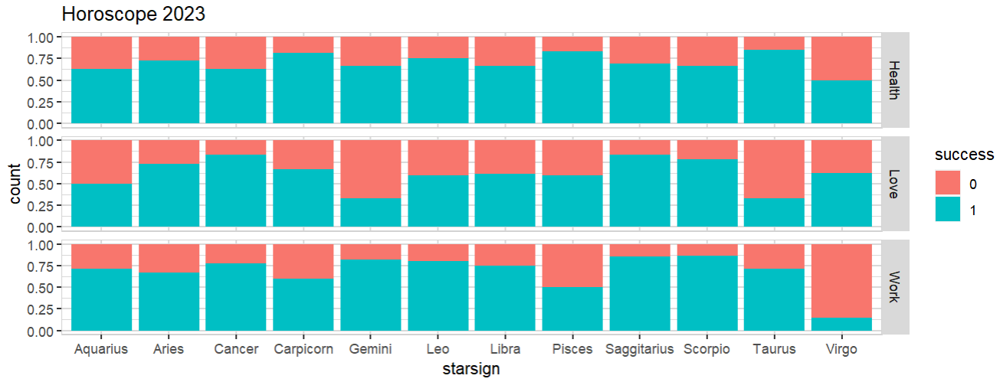

Tired of reading 2023 predictions based on starsigns? Make your own!

```R
library(explore)
set.seed(13)   # change as you like!
data <- create_data_empty(obs = 300)
data <- data |> 
  add_var_random_cat("type", c("Work", "Love", "Health")) |> 
  add_var_random_01("success", prob = c(0.3, 0.7)) |> 
  add_var_random_starsign("starsign")
  
head(data)
```

We have "simulated" the new year for 300 people and tracked their success in the categories "Work", "Love" and "Health":

```
    type success    starsign
1   Work       1      Gemini
2   Love       1       Aries
3 Health       0      Gemini
4   Love       0       Virgo
5   Work       1     Scorpio
6   Love       1 Saggitarius
```

Now let's create a (bullshit) horoscope:

```R
data |> explore(starsign, success, target = type, title = "Horoscope 2023")    
```



You don't like what you've got? No problem, just change ```set.seed``` and re-run the code!

Happy 2023!
