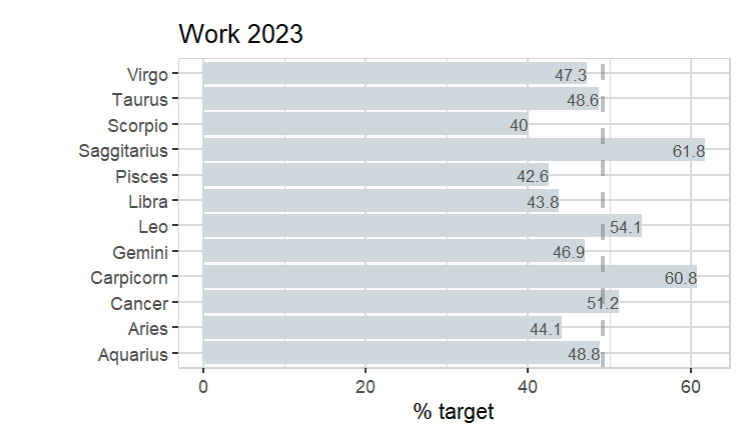
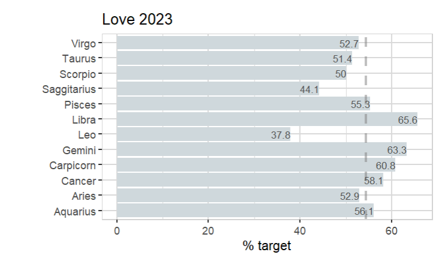
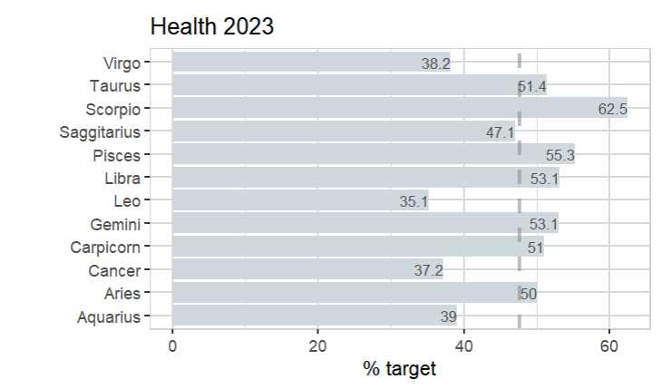

Tired of reading 2023 predictions based on starsigns? Make your own!

```R
library(explore)

data <- create_data_empty(obs = 500) |>
  add_var_random_starsign("starsign", seed = 10) |> 
  add_var_random_01("success_work") |> 
  add_var_random_01("success_love") |> 
  add_var_random_01("success_health") 
  
describe(data)
```

```
   starsign success_work success_love success_health
1   Scorpio            0            0              1
2       Leo            0            0              0
3     Libra            0            1              0
4 Carpicorn            1            0              1
5    Gemini            1            0              0
6    Cancer            0            1              1
```

```R
data |> explore_targetpct(
  starsign, 
  target = success_work,
  title = "Work 2023")
```



```R
data |> explore_targetpct(
  starsign, 
  target = success_love,
  title = "Work 2023")
```



```R
data |> explore_targetpct(
  starsign, 
  target = success_health,
  title = "Work 2023")
```



You don't like what you've got? No problem, just change ```seed``` in ```add_var_random_starsign()``` and re-run the code!

Happy 2023!
