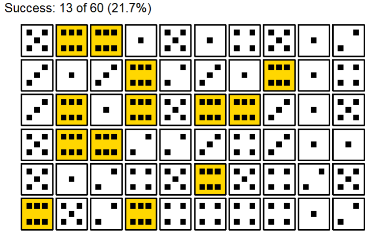

{tidydice} 1.0.0 is on CRAN!

A basic understanding of probability and statistics is crucial for data understanding. 
A great way to teach probability and statistics is to start with an experiment, like rolling a dice or flipping a coin.

{tidydice} simulates rolling a dice and flipping a coin. Each experiment generates tidy data (tibble). 
Dice rolls and coin flips are simulated using sample(). 
The properties of the dice can be changed, like the number of sides. 
A coin flip is simulated using a two sided dice. Experiments can be combined with the pipe-operator. 
  
## Design  
  
The default dice design is black/white with gold as highlight for a success 

```R
# use package
library(tidydice)
  
# example: roll 10x6 = 60 dice
roll_dice(times = 10, rounds = 6) |>
  plot_dice()
```



 You can control the design of dice using ```plot_dice()``` arguments: 
* ```fill``` = fill color of dice
* ```fill_success``` = fill color of dice if result is a success
* ```point_color``` = color of points
* ```line_color``` = color of lines
* ```line_size``` = size of lines

```R
roll_dice(times = 6) %>% 
  plot_dice(fill = "darkgrey", 
            fill_success = "darkblue",
            line_color = "white",
            point_color = "white")
```


