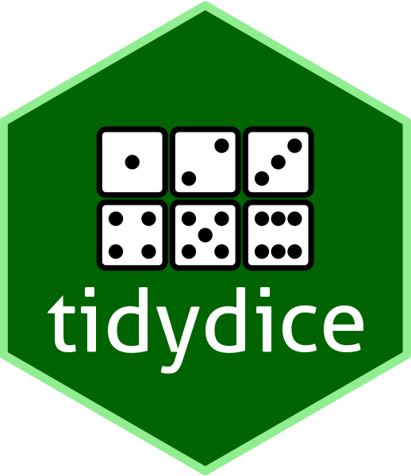
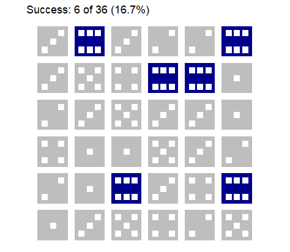
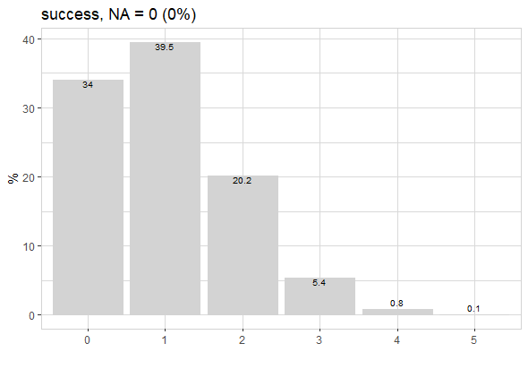
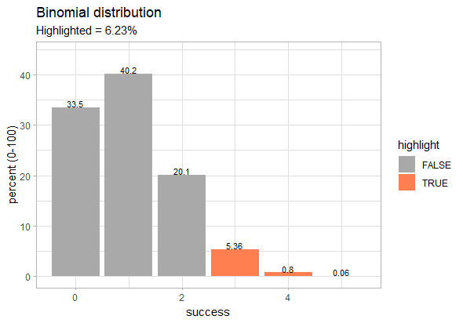
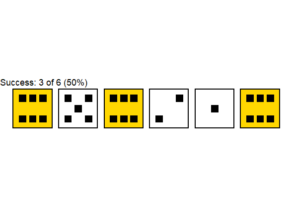
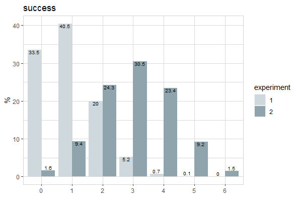
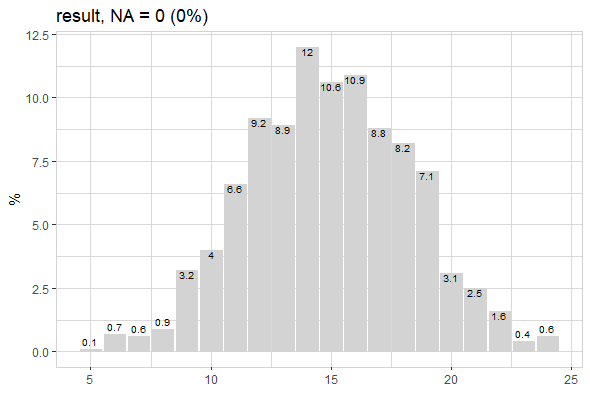

{tidydice} 1.0.0 is here!

## Why {tidydice}


A basic understanding of probability and statistics is crucial for data understanding. 
A great way to teach probability and statistics is to start with an experiment, like rolling a dice or flipping a coin.

{tidydice} simulates rolling a dice and flipping a coin. Each experiment generates tidy data (tibble). 
Dice rolls and coin flips are simulated using sample(). 
The properties of the dice can be changed, like the number of sides. 
A coin flip is simulated using a two sided dice. Experiments can be combined with the pipe-operator. 
  
## Design  
  
The default dice design is black/white with gold as highlight for a success.
To make it reproducible, use ```seed```

```R
# use package
library(tidydice)
  
# example: roll dice 6 times
roll_dice(times = 6, seed = 123) |>
  plot_dice()
```


 You can control the design of dice using ```plot_dice()``` arguments: 
* ```fill``` = fill color of dice
* ```fill_success``` = fill color of dice if result is a success
* ```point_color``` = color of points
* ```line_color``` = color of lines
* ```line_size``` = size of lines

```R
roll_dice(times = 6, seed = 123) |> 
  plot_dice(fill = "darkgrey", 
            fill_success = "darkblue",
            line_color = "white",
            point_color = "white")
```


## Repeat

We see 2 six. This is more than th expected value, which is 1. (A dice has 6 sides, so the probability of getting a six is 1/6)

Now let's repeat this experiment 6 times

```R
roll_dice(times = 6, rounds = 6, seed = 123) |> 
  plot_dice(fill = "darkgrey", 
            fill_success = "darkblue",
            line_color = "white",
            point_color = "white")
```



Now we get 6 six. This is excactly the expected value.

## Aggregate

Lets increase rounds to 10 000. To see how many times we got a six in each round, use ```agg = TRUE```

```R
roll_dice(times = 6, rounds = 10000, agg = TRUE, seed = 123)
```

```
# A tibble: 10,000 × 4
   experiment round times success
        <int> <int> <int>   <int>
 1          1     1     6       2
 2          1     2     6       2
 3          1     3     6       0
 4          1     4     6       0
 5          1     5     6       2
 6          1     6     6       0
 7          1     7     6       0
 8          1     8     6       1
 9          1     9     6       0
10          1    10     6       1
# … with 9,990 more rows
```

We get a tibble, where each row represents one round.

Let's use {explore} to visualise the result

```R
roll_dice(times = 6, rounds = 10000, agg = TRUE, seed = 123) |>
  explore(success)
```



## Binomial Distribution

By repeating the experiment 10 000 times we already get pretty close to the Binomial Distribution:

```R
binom_dice(times = 6)
```

```
# A tibble: 7 × 3
  success         p      pct
    <int>     <dbl>    <dbl>
1       0 0.335     33.5    
2       1 0.402     40.2    
3       2 0.201     20.1    
4       3 0.0536     5.36   
5       4 0.00804    0.804  
6       5 0.000643   0.0643 
7       6 0.0000214  0.00214
```

```R
binom_dice(times = 6) |>
  plot_binom(highlight = 3:6)
```



The chance to get 3 or more six is just 6.23%

## Cheating

We can cheat by increasing the probability of getting a six from 1/6 (0.167) to 1/2 (0.5).

```R
roll_dice(
  times = 6, 
  prob = c(0.1,0.1,0.1,0.1,0.1,0.5), 
  seed = 123
) |> plot_dice()
```  



Can this cheating be detected? 3 six is still in a normal range.

Let's do an experiment!

```R
roll_dice(times = 6, rounds = 10000, agg = TRUE) |>
  roll_dice(
    times = 6, rounds = 10000, agg = TRUE, 
    prob = c(0.1,0.1,0.1,0.1,0.1,0.5)) |> 
  explore(success, target = experiment)
```  



The plot shows, that there is a high chance that the cheating will be detected, if we roll the dice multiple times. 
Because getting 4 or more six is very unlikely if there is no cheating.

### Using Dice Formula

If you want to do more complex dice rolls, use ```roll_dice_formula()``` (many thanks to Giovanni Marco for contributing the code!)

```R
roll_dice_formula(
  dice_formula = "4d6", # 4 dice with 6 sides
  success = 15:24,      # success: sum between 15 and 24
  seed = 123            # random seed to make it reproducible
)
```

```
# A tibble: 1 × 7
  experiment dice_formula label round    nr result success
       <int> <chr>        <chr> <int> <int>  <dbl> <lgl>  
1          1 4d6          4d6       1     1     18 TRUE  
```

```R
roll_dice_formula(
  dice_formula = "4d6+1d10", # 4 dice with 6 sides + 1 dice with 10 sides
  rounds = 1000) %>%         # repeat 1000 times
  explore_bar(result, numeric = TRUE)
```



Other examples for dice_formula:

- ```1d6``` = roll one 6-sided dice
- ```1d8``` = roll one 8-sided dice
- ```1d12``` = roll one 12-sided dice
- ```2d6``` = roll two 6-sided dice
- ```1d6e6``` = roll one 6-sided dice, explode dice on a 6
- ```3d6kh2``` = roll three 6-sided dice, keep highest 2 rolls
- ```3d6kl2``` = roll three 6-sided dice, keep lowest 2 rolls
- ```4d6kh3e6``` = roll four 6-sided dice, keep highest 3 rolls, but explode on a 6
- ```1d20+4``` = roll one 20-sided dice, and add 4
- ```1d4+1d6``` = roll one 4-sided dice and one 6-sided dice, and sum the results

## Weblinks

* {tidydice} on Github: <https://github.com/rolkra/tidydice> 
* {explore} on Github: <https://github.com/rolkra/explore>
