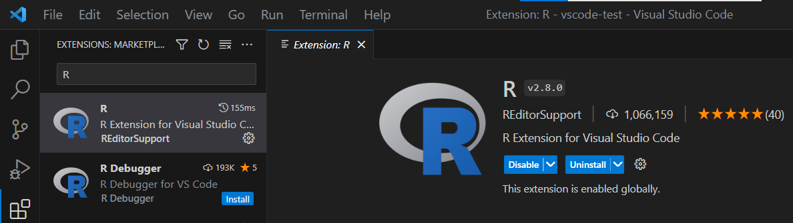
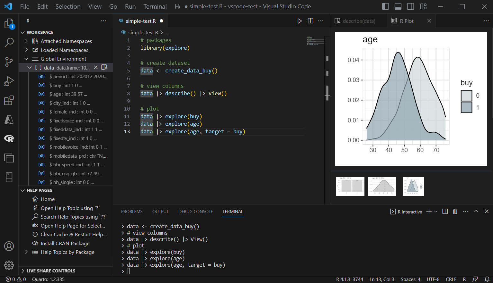

This is my (simple) setup for using a local R + VSCode

### Install R & Packages

If R is not installed on your local computer, install it!

See [CRAN](https://cran.r-project.org)

Then you need to install the following R-packages (from CRAN)

```R
# R Syntax Highlightning
install.packages("languageserver") 

# Better plot Outputs for VSCode
install.packages("httpgd")          
```

### Install VSCode 
  
If VSCode is not installed on your local computer, install it!

See [visualstudio.com](https://code.visualstudio.com/download)

### VSCode R Extension 

In VSCode you can install Extensions. You will need the Extension "R Extension for Visiual Stuido Code (REditorSupport)



### Connect R

The R path might be detected automatically. If not, you need to set it in the Extensions Settings.

Set R path: Extensions (left bar) > Select R Extension > Settings icons > Extensions Settings

* R > Rpath: Windows (if Windows is used) ... set path to where your R.exe is located (e.g. C:/R-4.1.3/bin/R.exe)
* R > RTerm: Windows (if Windows is used) ... set path to where your R.exe is located (e.g. C:/R-4.1.3/bin/R.exe)
* R > Lib Paths  ... set path to your R directory (e.g. C:/R-4.1.3)

alternative in settings.json ... click Icon "Open Settings (JSON) 

You may need to restart your VSCode and Attach the R-Terminal by clicking "Not Attached" in the bottom line of the VSCode Editor. 
Then there you should see the R-Version you are using (in this case R 4.1.3)

### Settings for R

You can modify some other settings of the R-extension, to increase usability:

* "r.session.levelOfObjectDetail": "Normal" ... let you see variable names of a data.frame in the Environment-Viewer of the R extension
* "r.session.data.rowLimit": 1000 ... limits the View of data to max 1000 rows (speeds it up)


Make sure, that Httgpd is set (to show the plot output inside VSCode)


### Key-bindings

Files > Preferences > Keyboard Shortcuts > ... Click Icon "Open Keyboard Shortcuts (JSON)" 

You may want to define Keyboard Shortcuts you are used to, like:

```
// Place your key bindings in this file to override the defaults
[{
    "key": "ctrl+shift+m",
    "command": "editor.action.insertSnippet",
    "when": "editorTextFocus",
    "args": {
    "snippet": " |> "
    }
},
{
    "key": "ctrl+shift+m",
    "command": "workbench.action.terminal.sendSequence",
    "when": "terminalFocus",
    "args": {
    "text": " |> "
    }
},
{
    "key": "ctrl+shift+r",
    "command": "editor.action.insertSnippet",
    "when": "editorTextFocus",
    "args": {
    "snippet": "# section -----------------------------------------------------------\n"
    }
},
{
    "key": "ctrl+alt+i",
    "command": "editor.action.insertSnippet",
    "when": "editorTextFocus",
    "args": {
    "snippet": "```{r}\n$0\n```"
    }
}
]
```

### Code Styling

The R Extension uses lintr for code-styling (following tidyverse style guide https://style.tidyverse.org/index.html). 
You can adapt the default settings by using a .lintr file in your project directory.

Some useful settings:

```
linters: linters_with_defaults(
    line_length_linter(80),
    commented_code_linter = NULL,
    trailing_whitespace_linter = NULL,
    trailing_blank_lines_linter = NULL
  )
```

### VSCode Layout

In VSCode you have a lot of options to change the layout. This is the layout I use for R



If you installed the R extension, you get on the left you get an R icon. If you click on it, you get R specific views like "Globel Environment" and "Help Pages". In the "Global Environment" you can see all variables in your Environment including data frames. If the option "levelOfObjectDetail": "Normal" is set, you can see the variable names and type too.

In the center you have your code editor with syntax highligthning and code completion. In the bottom you have your R terminal.

On the right side you have the plot/HTML outputs. 

### VSCode Shortcuts

Useful shortcuts in VSCode

* F1	= opens all mighty search bar
* strg shift c	= open terminal / command line
* strg +	= increase text size
* strg -	= decrease text size
* strg f	= find
* strg s	= save file
* F11	= toggle full screen
* ctr k t	= Select Color Theme
