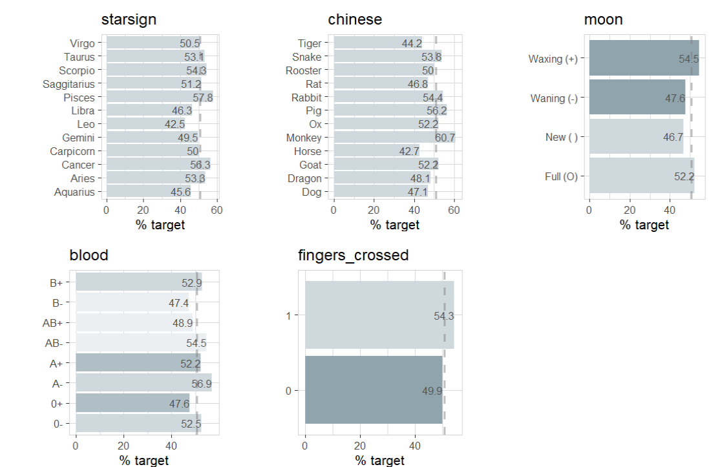

What we can learn from Esoteric Pattern (using R)

### Setup

If {explore} is not installed, install it from CRAN (you need explore 1.2.0 or higher)

```R
install.packages("explore") 
```

Then we can use it to create (and explore) some "esoteric data"

```R
library(explore)
data <- create_data_esoteric() 
```

Let's see how the data looks like:

```R
data |> describe_tbl()
```

```
1 000 (1k) observations with 6 variables
0 observations containing missings (NA)
0 variables containing missings (NA)
0 variables with no variance
```

```R
data |> describe_all()
```

```
# A tibble: 6 × 8
  variable        type     na na_pct unique   min  mean   max
  <chr>           <chr> <int>  <dbl>  <int> <dbl> <dbl> <dbl>
1 starsign        chr       0      0     12    NA NA       NA
2 chinese         chr       0      0     12    NA NA       NA
3 moon            chr       0      0      4    NA NA       NA
4 blood           chr       0      0      8    NA NA       NA
5 fingers_crossed int       0      0      2     0  0.17     1
6 success         int       0      0      2     0  0.51     1
```

So we have a dataset with 1000 observations and 6 variables. Let's take a closer look:

```R
data |> explore_all()
```


The obvious question is: is there a correlation between success and the other variables:

```R
data |> explore_all(target = success, targetpct = TRUE)
```



Ok, there are some intersting correlations. But what does that actually mean?
Does starsign "Pisces", chinese zodiac "Monkey", a waxing moon, blood type A- or keeping fingers crossed have a positive impact on success?

What if these patterns are just random? We can find out by testing if these patterns are statistically significant:

```R
data |> abtest(starsign == "Pisces", target = success)
```


The A/B test shows, that the relationship between starsign "Pisces" and success is not no statistically significant. People with starsign "Pisces" have a higher chance of success (in this data), but this seems to be only a random pattern, not a real correlation (or causation).

We can A/B test all the other variables too

```R
data |> abtest(chinese == "Monkey", target = success)
data |> abtest(moon == "Waxing (+)", target = success)
data |> abtest(blood == "A-", target = success)
data |> abtest(fingers_crossed == "A-", target = success)
```


All are not statistically significant (but chinese zodiac "Monkey" and waxing moon are quite close)!


