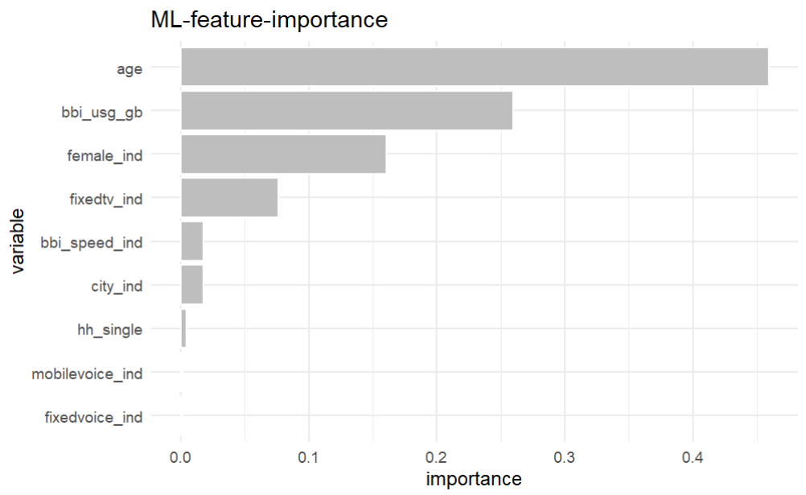
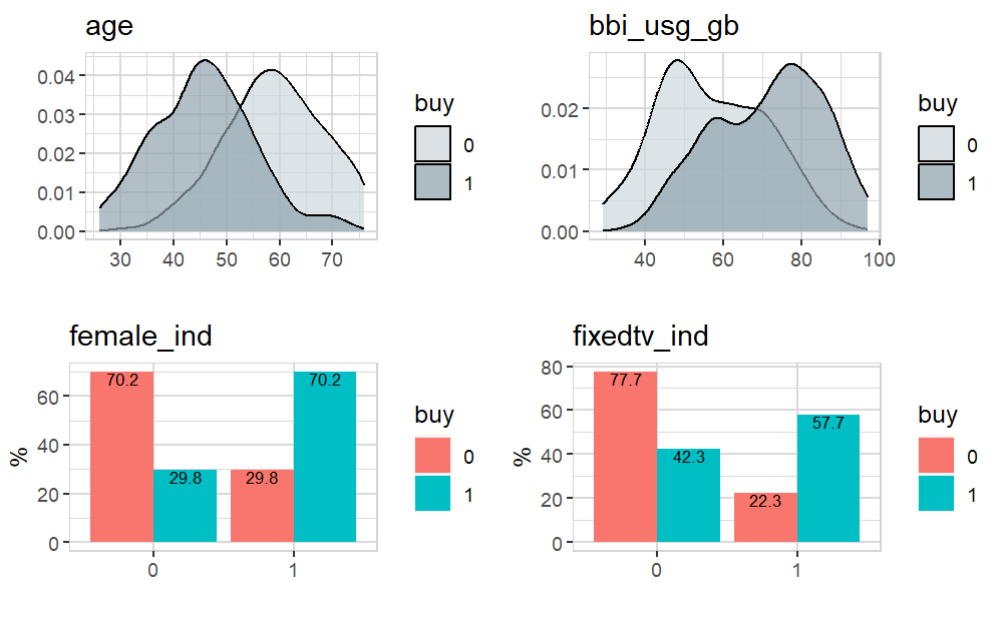
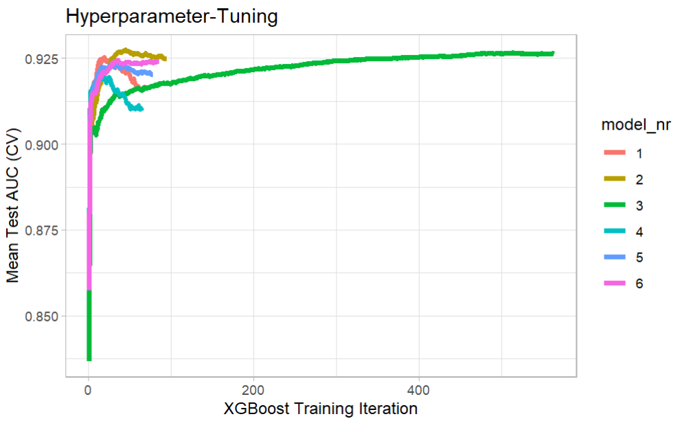

Let's create a XGBoost model (the easy way)

### Setup

If {explore} is not installed, install it from CRAN (you need explore 1.2.0 or higher)

```R
install.packages("explore") 
```

Then we simply load the package and create some data

```R
library(explore)
data <- create_data_buy(obs = 1000)
```
### Data preparation

Let's take a look into the data

```R
data |> describe()
```
```
# A tibble: 13 x 8
   variable        type     na na_pct unique    min      mean    max
   <chr>           <chr> <int>  <dbl>  <int>  <dbl>     <dbl>  <dbl>
 1 period          int       0      0      1 202012 202012    202012
 2 buy             int       0      0      2      0      0.51      1
 3 age             int       0      0     66     17     52.3      88
 4 city_ind        int       0      0      2      0      0.5       1
 5 female_ind      int       0      0      2      0      0.5       1
 6 fixedvoice_ind  int       0      0      2      0      0.11      1
 7 fixeddata_ind   int       0      0      1      1      1         1
 8 fixedtv_ind     int       0      0      2      0      0.4       1
 9 mobilevoice_ind int       0      0      2      0      0.63      1
10 mobiledata_prd  chr       0      0      3     NA     NA        NA
11 bbi_speed_ind   int       0      0      2      0      0.61      1
12 bbi_usg_gb      int       0      0     83      9    164.   100000
13 hh_single       int       0      0      2      0      0.37      1
```
So we got a dataset with 13 variables. `buy` is a binary variable, 
containing only 2 unique values: 0 and 1. We will use `buy` as target.

For the XGBoost we just need numeric variables. Here we have a character variable. 
We could try to convert it into a meaningful numeric variable, but in this example we will simply
drop all variables that are not numeric or have no variance.

```R
data <- data |> 
  drop_var_no_variance() |> 
  drop_var_not_numeric()

data |> describe()
```
```
# A tibble: 10 x 8
   variable        type     na na_pct unique   min   mean    max
   <chr>           <chr> <int>  <dbl>  <int> <dbl>  <dbl>  <dbl>
 1 buy             int       0      0      2     0   0.51      1
 2 age             int       0      0     66    17  52.3      88
 3 city_ind        int       0      0      2     0   0.5       1
 4 female_ind      int       0      0      2     0   0.5       1
 5 fixedvoice_ind  int       0      0      2     0   0.11      1
 6 fixedtv_ind     int       0      0      2     0   0.4       1
 7 mobilevoice_ind int       0      0      2     0   0.63      1
 8 bbi_speed_ind   int       0      0      2     0   0.61      1
 9 bbi_usg_gb      int       0      0     83     9 164.   100000
10 hh_single       int       0      0      2     0   0.37      1
```
Now we have only 13 variables. `period` and `fixeddata_ind` are dropped because they contain only a constant value (no variance).
`mobiledata_prd` is dropped because it is not numeric.

### Create XGBoost

We are ready to create a XGBoost model. It is as simple as this:

```R
data |> explain_xgboost(target = buy)
```

We get the feature importance of a XGBoost model explaining the target `buy`: 



The most important varaibles are 'age', `bbi_usg_gb`, `femaale_ind` and `fixed_tv_ind`

Let's take a closer look to their relationship with the target variable `buy`:

```R
library(dplyr)  # for select
data |> 
  select(buy, age, bbi_usg_gb, female_ind, fixedtv_ind) |> 
  explore_all(target = buy)
```



So with the help of `explain_xgboost()` we can understand which variables explain the target `buy`.

### More XGBoost

`explain_xgboost()` can return much more:

```R
data |> explain_xgboost(target = buy, out = "all") -> model
```

Now you get more outputs. `model$plot` is the feature-important plot. You get the data behind:

```R
model$importance
```

```
          variable        gain       cover  frequency  importance
1:             age 0.459501045 0.338333975 0.29666667 0.459501045
2:      bbi_usg_gb 0.259520698 0.304656256 0.31333333 0.259520698
3:      female_ind 0.160985735 0.150706363 0.13333333 0.160985735
4:     fixedtv_ind 0.076391986 0.106877646 0.11333333 0.076391986
5:   bbi_speed_ind 0.017973412 0.028905647 0.03666667 0.017973412
6:        city_ind 0.017914818 0.050673036 0.05000000 0.017914818
7:       hh_single 0.004823200 0.013086040 0.03000000 0.004823200
8: mobilevoice_ind 0.001655567 0.003425110 0.01333333 0.001655567
9:  fixedvoice_ind 0.001233540 0.003335926 0.01333333 0.001233540
```

And the result of hyper parameter tuning

```R
model$tune_plot
```



```R
model$tune_data
```

```
   model_nr  eta max_depth runtime iter train_auc_mean test_auc_mean
1:        1 0.30         3  0 mins   19      0.9579619     0.9252692
2:        2 0.10         3  0 mins   45      0.9572738     0.9274616
3:        3 0.01         3  0 mins  513      0.9582980     0.9266134
4:        4 0.30         5  0 mins   15      0.9796771     0.9201005
5:        5 0.10         5  0 mins   28      0.9731001     0.9232089
6:        6 0.01         5  0 mins   36      0.9572939     0.9244891
```
