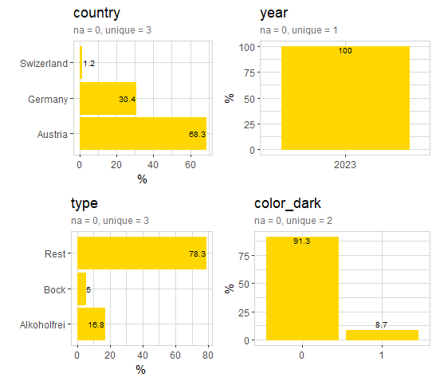
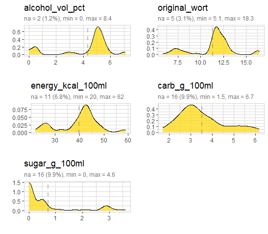
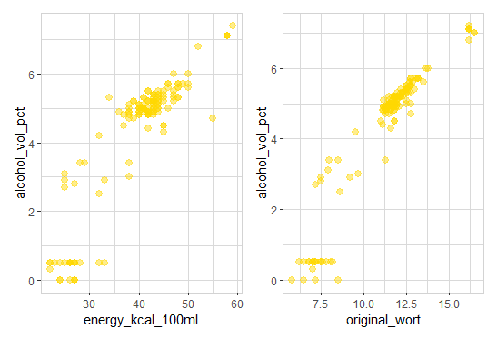
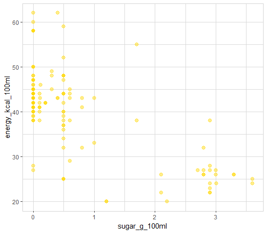
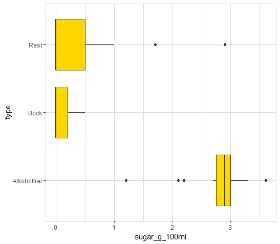
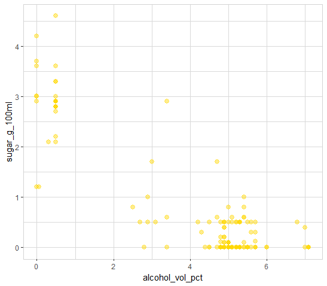
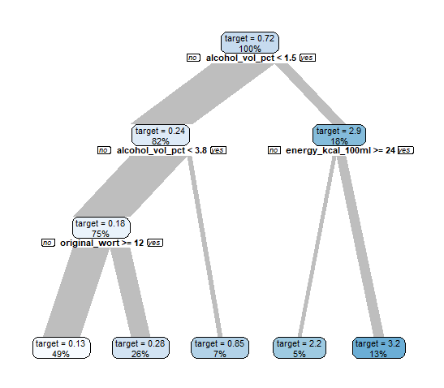
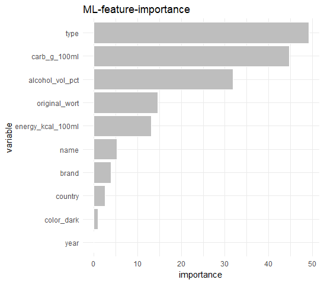

Let's dive into beer-data and build a beer-AI!

### Setup

If {explore} is not installed, install it from CRAN (you need explore 1.2.0 or higher)

```R
install.packages("explore") 
```

Then we simply load the package and use the beer data!

```R
library(explore)
data <- use_data_beer()
```

### Data understanding

Firest, we describe the table:

```R
data |> describe_tbl()
```

```
161 observations with 11 variables
19 observations containing missings (NA)
5 variables containing missings (NA)
1 variables with no variance
```

Then we describe all variables:

```R
data |> describe_all()
```

```
# A tibble: 11 x 8
   variable          type     na na_pct unique    min    mean    max
   <chr>             <chr> <int>  <dbl>  <int>  <dbl>   <dbl>  <dbl>
 1 name              chr       0    0      161   NA     NA      NA  
 2 brand             chr       0    0       29   NA     NA      NA  
 3 country           chr       0    0        3   NA     NA      NA  
 4 year              dbl       0    0        1 2023   2023    2023  
 5 type              chr       0    0        3   NA     NA      NA  
 6 color_dark        dbl       0    0        2    0      0.09    1  
 7 alcohol_vol_pct   dbl       2    1.2     35    0      4.32    8.4
 8 original_wort     dbl       5    3.1     54    5.1   11.3    18.3
 9 energy_kcal_100ml dbl      11    6.8     34   20     39.9    62  
10 carb_g_100ml      dbl      16    9.9     44    1.5    3.53    6.7
11 sugar_g_100ml     dbl      16    9.9     26    0      0.72    4.6
```

So we got 161 beers (29 different brands) from 3 countries. For most of the beers we got most common attributes like alcohol (in volumne percent), original wort, energy (in kcal per 100 ml), and so on. 
Let's take a closer look to some of the attributes (we will use "beer-like" golden color for the plots):

```R
library(dplyr)
data |> 
  select(country, year, type, color_dark) |> 
  explore_all(color = "gold")
```



Most of the beers are produced in Austria, some in Germany and Switzerland. All beer-data are collected in 2023. 
Beer types are "Alkoholfrei", "Bock" and "Rest. "Rest is the most common beer type. Below 10% of all beers have a dark color.

```R
data |> 
  select(alcohol_vol_pct, original_wort, energy_kcal_100ml, carb_g_100ml, sugar_g_100ml) |> 
  explore_all(color = "gold")
```



We see, **some of the beers actually contain sugar!**

Somme of the beers have attributes with undefined values (na). The density-plot of `alcolhol_vol_pct`, `energy_kcal_100ml` and `original_wort` look quite similar, there seems to be a strong relationship. Let's check:

```R
data |> explore(energy_kcal_100ml, alcohol_vol_pct, color = "gold")
data |> explore(original_wort, alcohol_vol_pct, color = "gold")
```



Both, `energy_kcal_100ml` and `original_wort` have a strong relationship with `alcohol_vol_pct`

### Hypothesis

#### More sugar, more kcal

We test the hypothesis: "the more sugar a beer contains, the more energy (kcal/100ml)"

```R
data |> 
  explore(sugar_g_100ml, energy_kcal_100ml, color = "gold")
```



There seems to be a relationship between sugar and energy, but the higher the sugar, the lower the energy (kcal/100ml). Maybe sugar is related to the beer type too?

#### Sugar depends on beer-type

We test the hypothesis: "the amount of sugar in beer is defined by beer-type"

```R
data |> 
  explore(sugar_g_100ml, energy_kcal_100ml, color = "gold")
```



Beer type "Alkoholfrei" (alcohol free) has clearly the highest amount of sugar. Beer type "Bock" has the lowest amount of sugar. 
As the main difference between type "Bock" and "Alkoholfrei" is the amount of alcohol, we test the relationship between sugar and alcohol too:

#### Sugar depends on alcohol

We test the hypothesis: "the less alcohol in a beer, the more sugar"

```R
data |> 
  explore(sugar_g_100ml, alcoholkcal_100ml, color = "gold")
```


### Explain sugar

#### Decision Tree

Ok, it seeems that sugar is depending not just on one single attribute. To explain sugar, we use the machine learning algorithm "Decision Tree":

```R
data |> 
  explain_tree(target = sugar_g_100ml)
```



The decision tree explains the relationship between sugar with the other attributes `alcohol_vol_pct`, `energy_kcal_100_ml` and `original_wort`.
So, if the beer contains less than 1.5% alcohol in 100 ml, then it contains more sugar (in average 2.9 g / 100ml). If the beer contains more than 1.5% alcohol in 100 ml, 
then the beer contains a low amount of sugar. The lowest sugar have beer with > 3.8% alcohol in 100 ml and original_wort < 12.

#### Random Forest

Now let's use a more detailed machine learning algorithm: "Random Forest" to explain sugar in beer.

```R
data |> 
  drop_obs_with_na() |> 
  explain_forest(target = sugar_g_100ml)
```



We can see sugar depends on many attributes. `alcohol_vol_pct`, `energy_kcal_100ml` and `original_wort` are still in the model, but the "Random Forest" rank other attributes higher. 
The strongest are: 
* `type`:  as we already saw that beer-type "Alkoholfrei" contains the highest amount of sugar
* `carb_g_100ml`: as sugar is a type of carb (carbohydrates)
* `alcohol_vol_pct`: as we saw that higher alcohol means lower sugar

`original_wort`and `energy_kcal_100ml` have a medium impact on sugar. The rest of the attributes have a low (or no) impact on sugar.

The rest of the attributes are less convincing.
