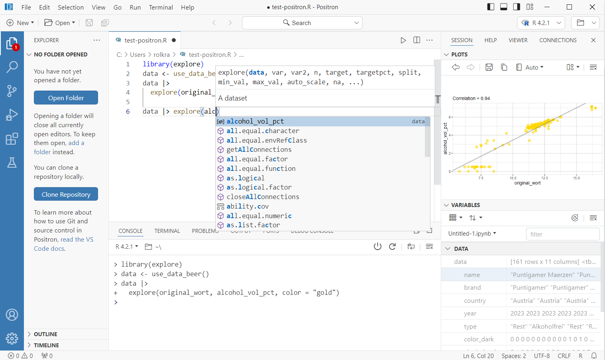
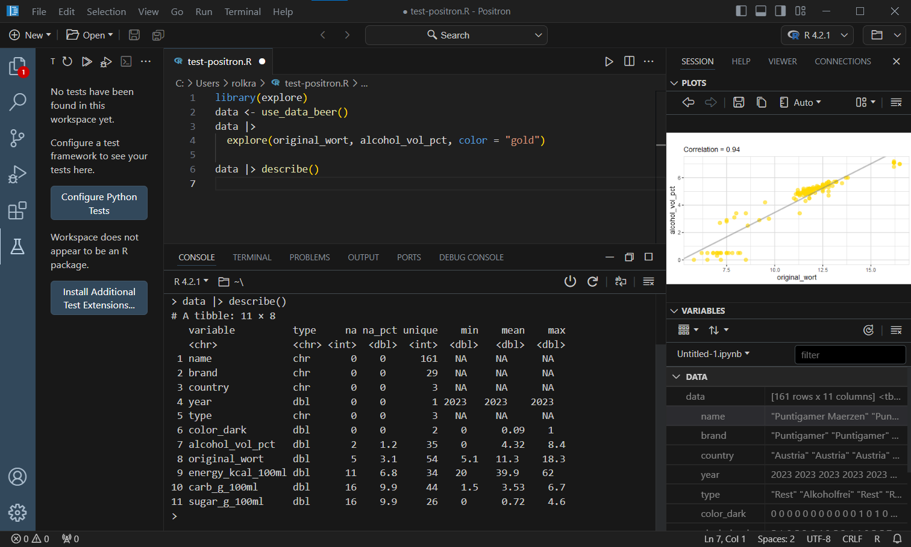
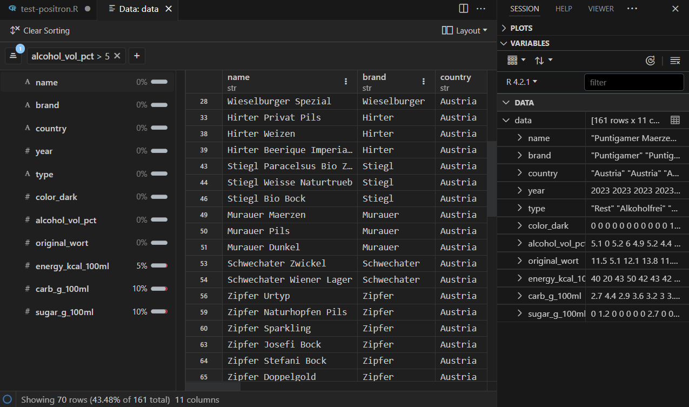

Positron is in early beta, but still promising. Take a look!

### Install

You can find positron here: <https://github.com/posit-dev/positron/releases>

Select the latest version and go to "Assets". There you find different installers for windows/mac/linux.

The wiki gives you more background infos: <https://github.com/posit-dev/positron/wiki>

### Get Started

Once you have installed Positron, create a new R file (select menu File > New File > R File).

In my case, Positron already found my R installation, I was ready to go!


Running R code works as expected (including code completion)



### Dark Mode

You can switch easily to dark mode by selecting the settings-icon on the bottom left of the screen. And then selecting Themes > Color Theme



### Data Explorer

I really like the built in data explorer. On the left you can see an overview of all variables with percentage of NULL values. And you can define a filter easily.



### Limitations

I expect Positron to improve fast, but at the moment (July 2024) there are some major limitations. Quarto and inline HTML output do not work out of the box. If you want to run a code block, you need more than one ```<ctrl> <enter>``` (unlike RStudio IDE). Some of the keyboard shortcuts I am used to are missing. But you may define it by yourself using the settings-icon on the bottom left of the screen. However, ```<ctrl <shift> M``` works as expected (pipe operator |> )

### Conclusion

Postiron is promising. It may become a great IDE for R and Python users that combine the best of both worlds from VSCode and RStudio IDE. But at the moment (July 2024 it is in beta and not everything works as expected)

Wanna try {explore}? 
See <https://github.com/rolkra/explore>
