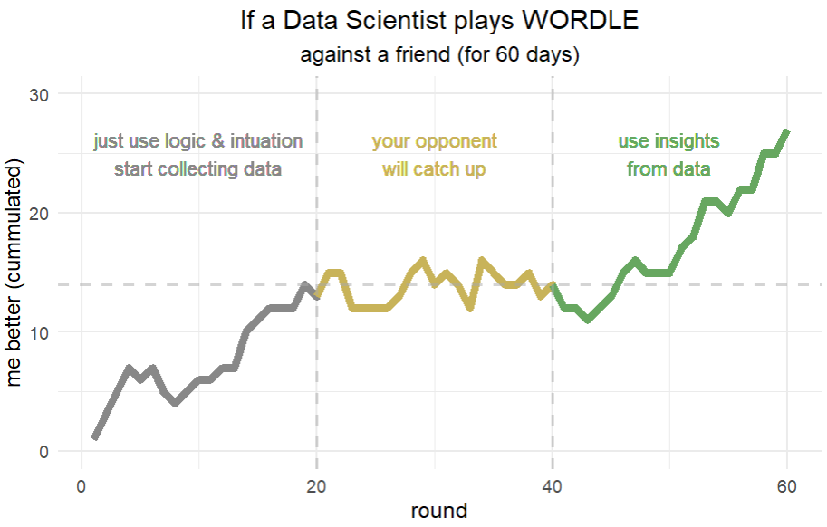
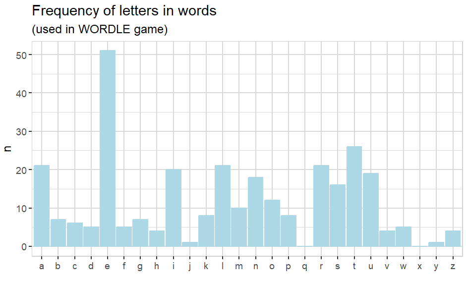
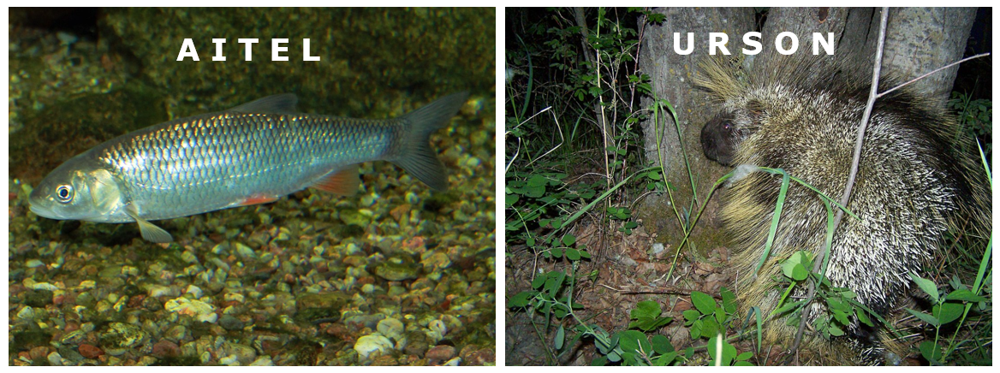

The power of small data!

WORDLE is a popular word-puzzle game. A friend and I started playing it daily and comparing our results. This is my journey:



### Collecting data (grey)

It was clear to me, that I will need data to understand this game better and to optimize my results. From my experience I knew that good, realistic data are the key to success. 
So, instead of just using words from a dictionary, I decided to start playing and simply collecting the data (but not using it).

In the first 20 days I performed better than my friend. I guess because I am very used to logic and analytically thinking.

### Lost advantage (yellow)

My friend improved over time. He optimized his strategy simply by try and error and my early advantage seems to be gone.

The next 20 days we had quite similar results, no one was able to get ahead. 
I continued collecting data, hoping that this will give me a boost my performance later.

### The power of data (green)

After 40 days of playing WORDLE and collecting data, I decided to start using the data. And it worked surprisingly well. 
This is what I did: First, I checked the type of the word. Only 6 out of 60 words are not a noun. 
So focusing on nouns seems to be a good strategy.

Then I checked the frequency of letters:



OK, so it seems to be obvious, that using a "start-word" that contains a lot of "popular" letters is helpful. And in case no letters match, 
it would be good to have a 2nd word, that contains a lot of "popular" letters from the rest.

Furthermore, I checked if those start-words may already have a letter in the correct position (testing the past wordle-words). 
I decides to create a scoring system: if the letter+position matches it counts 2 scores, if only the letter matches it counts 1. 
So I was able to test words and combination of two words and find a maximum:

* "raten" + "filou" = 152 + 84 = 236
* "linse" + "autor" = 125 + 114 = 239
* "eines" + "autor" = 133 + 114 + = 247

Then I started looking for more unusual words. And I found two surprising german words (by trial & error):

* "aitel" + "urson" = 152 + 97 = 249

These two words contain all of the top 10 letters. And if you are speaking German and wonder what these words actually mean: 
"Aitel" is a fish and "Urson" is an animal too - a rodent with stings.



### Conclusion

Even small data can give you a big advantage that outperformes using logic and intuition.

Interested in analysing the wordle data by yourself? Use {explore} (you need version 1.3.3 or later)

```R
library(explore)
wordle <- use_data_wordle()
wordle |> describe()
wordle |> explore(try, target = player)
```

You can find {explore} here: <https://github.com/rolkra/explore>
