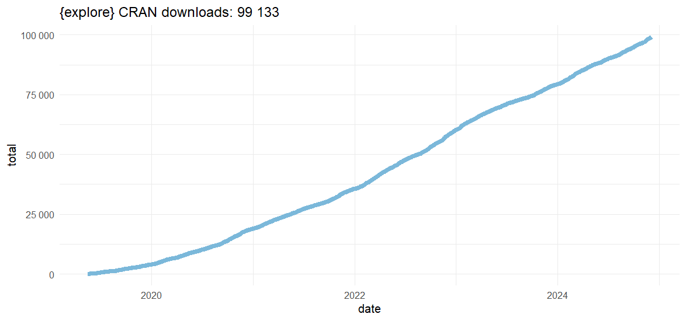
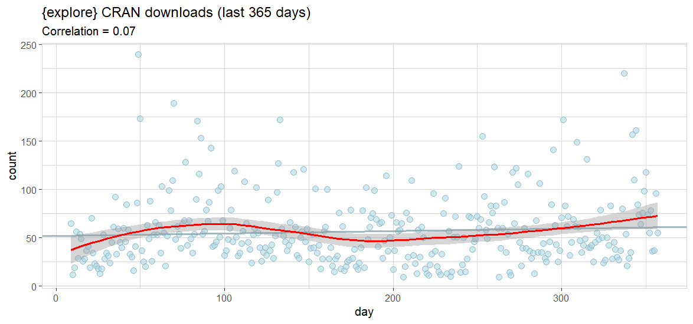

When will {explore} CRAN downloads hit 100k? 

Let's find out!

# Get the data

First, we get the CRAN download statistics of {explore} using {cranlogs}, and do some data cleaning and add a cummulated sum:

```R
library(tidyverse)
library(explore)
library(cranlogs)

data <- cran_downloads("explore", from = "2019-05-15") |>
  filter(date >= min(data[data$count > 0, ]$date)) |>
  filter(date <= max(data[data$count > 0, ]$date)) |>
  mutate(total = cumsum(count))

data |> glimpse()
```

```
Rows: 2,031
Columns: 4
$ date    <date> 2019-05-16, 2019-05-17, 2019-05-18, 2019-05-19, 2019-05-…
$ count   <dbl> 5, 22, 12, 13, 21, 12, 32, 24, 20, 9, 9, 12, 10, 18, 3, 6…
$ package <chr> "explore", "explore", "explore", "explore", "explore", "e…
$ total   <dbl> 5, 27, 39, 52, 73, 85, 117, 141, 161, 170, 179, 191, 201,…
```

# Visualize it

Now let's take a look:

```R
data |> 
  ggplot(aes(x = date, y = total)) +
  geom_line(color = "#7BB8DA", size = 2) +
  scale_y_continuous(labels = function(x) format(x, big.mark = " ")) +
  theme_minimal() +
  ggtitle(paste("{explore} CRAN downloads:", format(sum(data$count), big.mark = " "))) 
```



So it is very close to 100k. Let's take a closer look to daily downloads of the last year:

```R
data |>
  slice_tail(n = 365) |> 
  add_var_id(name = "day") |>
  explore(day, count, title = "{explore} CRAN downloads (last 365 days)") +
  geom_smooth(color = "red")
```



# Predict

OK, the last date with downloads is 2024-12-05. {explore} has 99 133 total CRAN downloads. In the last two months, there have been between 50 and 75 downloads per day in average. How long will it take to reach 100k? 100 000 - 99 133 = 866 downloads missing.

* 50 downloads per day: 866 / 50 = 17.32 days -> 100k until 2024-12-22
* 75 downloads per day: 866 / 75 = 11.55 days -> 100k until 2024-12-17

So, the chances are high to celebrate 100k before X-mas!
