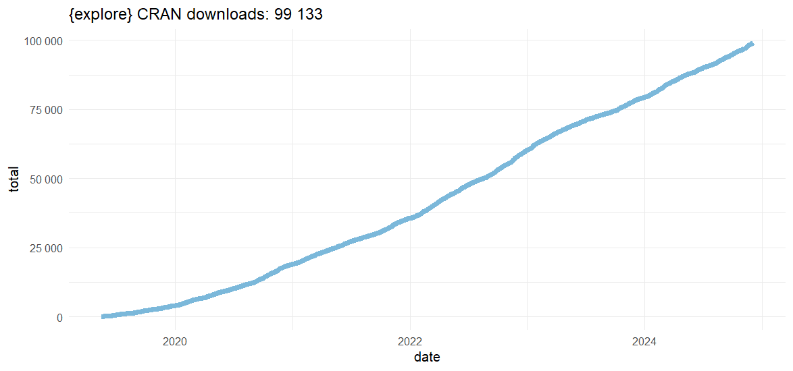
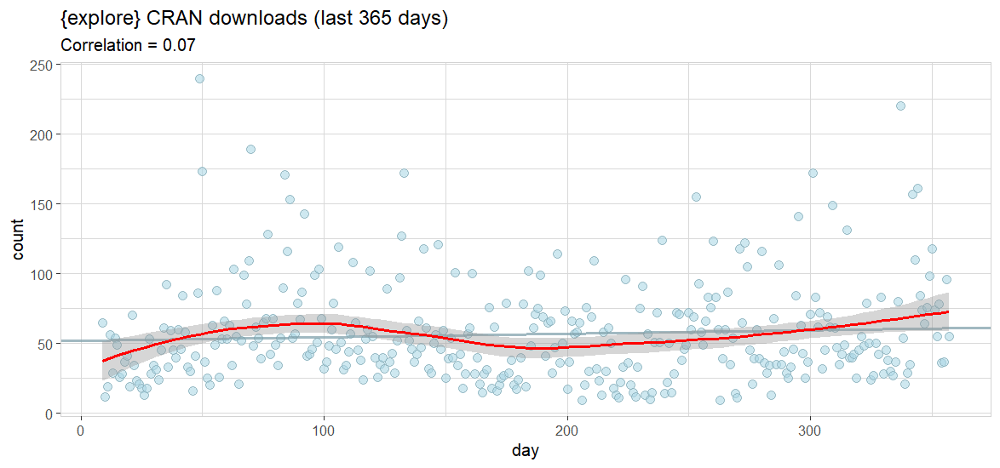

When will {explore} CRAN download hit 100k? 

Let's find out!

First, we get the CRAN download statistics of {explore} using {cranlogs}.

```R
library(tidyverse)
library(explore)
library(cranlogs)

data <- cran_downloads("explore", from = "2019-05-15")
data$total <- cumsum(data$count)

date_active <- data |> 
  filter(count > 0) |> 
  pull(date)

data <- data |> 
  filter(date >= min(date_active)) |> 
  filter(date <= max(date_active))

data |> glimpse()
```

```
Rows: 2,031
Columns: 4
$ date    <date> 2019-05-16, 2019-05-17, 2019-05-18, 2019-05-19, 2019-05-…
$ count   <dbl> 5, 22, 12, 13, 21, 12, 32, 24, 20, 9, 9, 12, 10, 18, 3, 6…
$ package <chr> "explore", "explore", "explore", "explore", "explore", "e…
$ total   <dbl> 5, 27, 39, 52, 73, 85, 117, 141, 161, 170, 179, 191, 201,…
```

Let's visualize it:

```R
data |> 
  ggplot(aes(x = date, y = total)) +
  geom_line(color = "#7BB8DA", size = 2) +
  scale_y_continuous(labels = function(x) format(x, big.mark = " ")) +
  theme_minimal() +
  ggtitle(paste("{explore} CRAN downloads:", format(sum(data$count), big.mark = " "))) 
```



So it is very close to 100k. Let's take a closer look to daily downloads of the last year:

```R
data |>
  slice_tail(n = 365) |> 
  add_var_id(name = "day") |>
  explore(day, count, title = "{explore} CRAN downloads (last 365 days)") +
  geom_smooth(color = "red")
```


