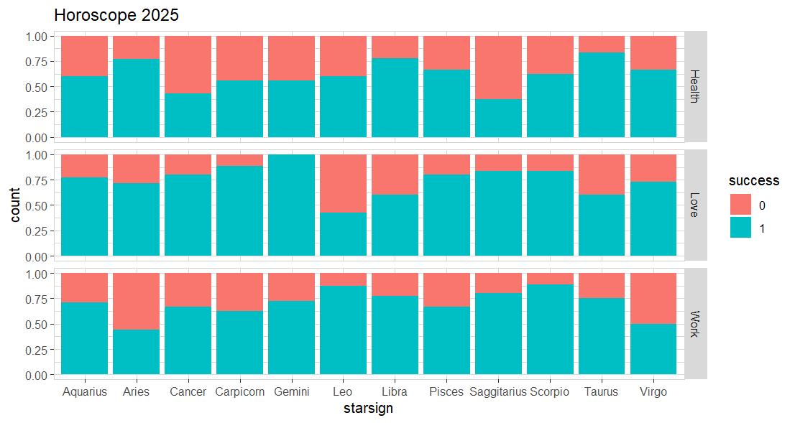

Tired of reading 2025 predictions based on starsigns? Make your own! 

```R
library(explore)

set.seed(10)   # change as you like!

create_data_empty(obs = 300) |> 
  add_var_random_cat("type", c("Work", "Love", "Health")) |> 
  add_var_random_01("success", prob = c(0.3, 0.7)) |> 
  add_var_random_starsign("starsign") |> 
  explore(starsign, success, target = type, 
          title = "Horoscope 2025")    
```



Not satisfied with this prediction! Simply change the set.seed in the code and re-run!

Wanna try {explore}?
* {explore} is on CRAN, to install: ```install.packages("explore")```
* {explore} is free and open source: <https://github.com/rolkra/explore>
* {explore} has it's own website: <https://rolkra.github.io/explore>
