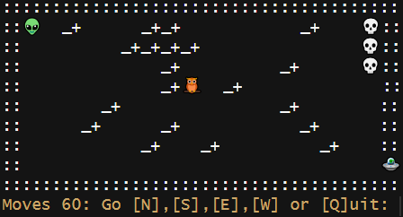
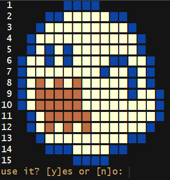
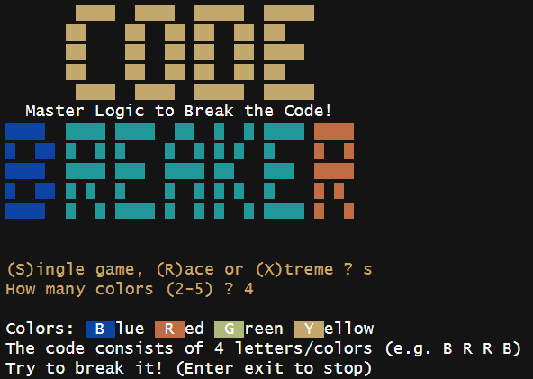

Have fun with these 3 retro games written in R:

I just finished my "trilogy" of retro games written in R. {creepyalien} completes {pixelpuzzle} and {codebreaker}

## {creepyalien}

You are an alien 👽 lost in a graveyard and have until midnight to find your way to your ship 🛸. 
Skeletons 💀 are waiting to scare you to death should you come to close. You can dig up to 5 holes to help keep them away. 
The owl 🦉 may give you some extra time!

```r
library(creepyalien)
creepyalien()
```



## {pixelpuzzle}

Select one of the pixel arts (Mario, Yoshi, Space Invaders, ...) and try to restore the pixel art by shifting rows!

```r
library(pixelpuzzle)
pixelpuzzle()
```



## {codebreaker}

You are a codebreaker and play against the computer who is the codemaker. 
The computer chooses a pattern of four colors (duplicates possible). 
You try to break the code by trying color patterns. The computer tells you the number of correct colors. 
Try to break the code in less steps as possible!

```r
library(codebreaker)
codebreaker()
```



## Wanna try?

All 3 games are available on CRAN. Have fun!

Github-Repos:
* {creepyalien} <https://github.com/rolkra/creepyalien>
* {pixelpuzzle} <https://github.com/rolkra/pixelpuzzle>
* {codebreaker} <https://github.com/rolkra/codebreaker>
