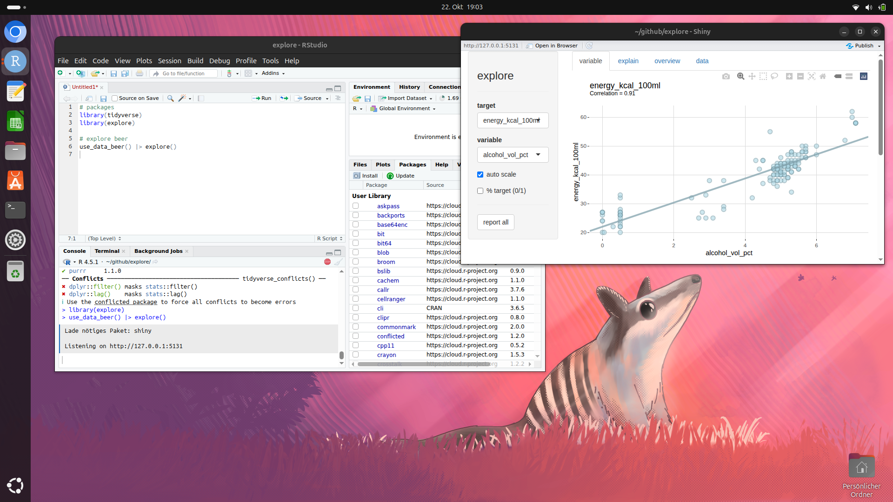
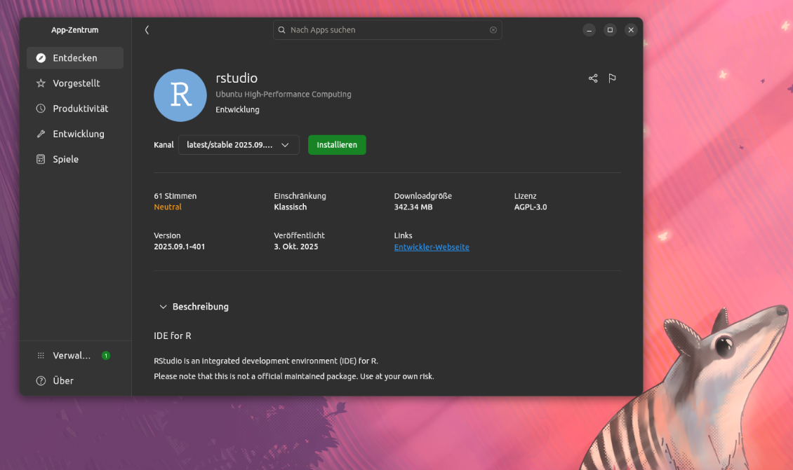
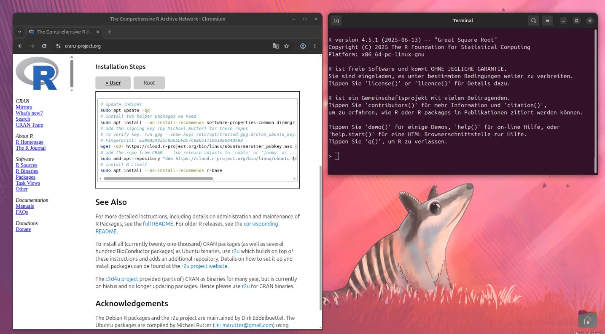

This is my recipe to switch to Ubuntu and set up R/RStudio:



I used my Dell XPS 15 9560 to develop and maintain my R packages {explore}, {tidydice}, {pixelpuzzle}, {creepyalien}, {codebreaker}, ... 
But Microsoft decided to stop supporting Windows 10 and didn't allow my laptop to upgrade to Windows 11. This gave me the final push to switch to Ubuntu: 

## Get Ubuntu

Download the Ubuntu ISO from https://ubuntu.com/download/desktop and create a bootable usb-stick (I used rufus https://rufus.ie/de/)
Then you can reboot your computer and press F12 during booting. This will let you select your usb-stick to boot from. Then you may get an error (like I did):

You must "Turn off RST" first!

## Switch to AHCI

Reboot your laptop and press F2 during booting. This will show you the BIOS-menu.

Select ```Main > SATA Model > AHCI```

Then reboot again (press F12 and select your usb-stick)

## Install Ubuntu

Now you can install Ubuntu. I used Ubuntu 24.04.3 LTS. Just follow the installation-steps...

## Install RStudio

Open the App-Center and search for "RStudio". Then simply press "install"... (RStudio is provided as "Snap")



## Install R

R is not available in the App-Center, you need to use the Terminal to install it manually. Follow the steps on the CRAN website: https://cran.r-project.org/bin/linux/ubuntu/

You can use ```Control + Shift + v``` to paste text into the terminal



## Install R packages

Now you can install your favorite R packages by simply typing

```install.packages("<package>")``` in RStudio

But maybe now you run into some problems (like I did). When trying to install {tidyverse} I got a bunch of error messages. I found out, that my Ubuntu-system is lacking some system-packages that are needed. So I had to manually install them using the Terminal again. In my case I had to type:

```
sudo apt-get install zlib1g-dev
sudo apt-get install libcurl4-openssl-dev
sudo apt-get install libssl-dev
sudo apt-get install libxml2-dev
sudo apt-get install libfontconfig1-dev
sudo apt-get install libharfbuzz-dev
sudo apt-get install libfribidi-dev
sudo apt-get install libfreetype6-dev libpng-dev libtiff5-dev libjpeg-dev libwebp-dev
```

Then everything worked as expected!

Youn can find out by yourself, which Ubuntu-packages are missing by checking your error-messages for the string "[ANTICONF]". There the missing Ubuntu-packages are listed.

Have fun with R/RStudio on Ubuntu Linux!
