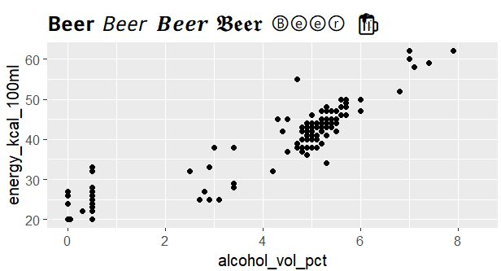

Format text using {utf8ify} if there is no format option!

𝑻𝑯𝑰𝑺 𝗶𝘀 𝘁𝗵𝗲 𝘀𝗲𝗰𝗿𝗲𝘁 how to format ⓣⓔⓧⓣ (𝖎𝖋 𝖙𝖍𝖊𝖗𝖊 𝖎𝖘 𝖓𝖔 𝖋𝖔𝖗𝖒𝖆𝖙 𝖔𝖕𝖙𝖎𝖔𝖓):

If you want to post a text, but there is no format-option. Check, if you can add some smileys 😀💡✔️ 

If yes, my R package {𝘂𝘁𝗳𝟴𝗶𝗳𝘆} does the trick! It let's you format text using utf8 characters. So every character of a 𝗯𝗼𝗹𝗱 text ist now translated into a corresponding bold utf8 character.

This is the code for the first line:

𝚕𝚒𝚋𝚛𝚊𝚛𝚢(𝚞𝚝𝚏𝟾𝚒𝚏𝚢)
𝚌𝚊𝚝(𝚙𝚊𝚜𝚝𝚎(
 𝚞𝚝𝚏𝟾_𝚝𝚎𝚡𝚝_𝚋𝚘𝚕𝚍𝚒𝚝𝚊𝚕𝚒𝚌("𝚃𝙷𝙸𝚂"),
 𝚞𝚝𝚏𝟾_𝚝𝚎𝚡𝚝_𝚋𝚘𝚕𝚍("𝚒𝚜 𝚝𝚑𝚎 𝚜𝚎𝚌𝚛𝚎𝚝"),
 "𝚑𝚘𝚠 𝚝𝚘 𝚏𝚘𝚛𝚖𝚊𝚝",
 𝚞𝚝𝚏𝟾_𝚝𝚎𝚡𝚝_𝚌𝚒𝚛𝚌𝚕𝚎("𝚝𝚎𝚡𝚝"),
 𝚞𝚝𝚏𝟾_𝚝𝚎𝚡𝚝_𝚐𝚘𝚝𝚑𝚒𝚌("(𝚒𝚏 𝚝𝚑𝚎𝚛𝚎 𝚒𝚜 𝚗𝚘 𝚏𝚘𝚛𝚖𝚊𝚝 𝚘𝚙𝚝𝚒𝚘𝚗):")
))

And the whole text above is without using HTML format-options. It's simply using the utf8 trick provided by {𝘂𝘁𝗳𝟴𝗶𝗳𝘆}


## ggplot

**{utf8ify}** your ggplot!

```
library(tidyverse)
library(explore)
library(utf8ify)

title <- paste(
 utf8_text_bold("Beer"),
 utf8_text_italic("Beer"),
 utf8_text_bolditalic("Beer"),
 utf8_text_gothic("Beer"),
 utf8_text_circle("Beer"),
 utf8_collection()$fav["beer"])

use_data_beer() |> 
 ggplot(aes(x = alcohol_vol_pct, y = energy_kcal_100ml)) +
 geom_point() +
 ggtitle(title) +
 theme(plot.title = element_text(size=20))
```


