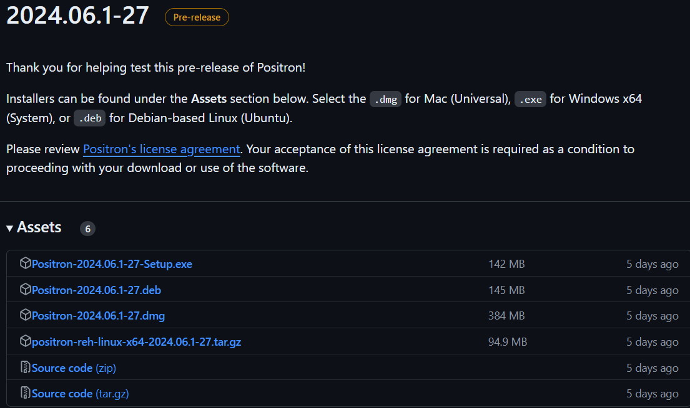

Positron is in early beta, but still promising. Take a look!

### Install

You can find positron here: <https://github.com/posit-dev/positron/releases>

### Get Started

Once you have installed Positron, create a new R file (select menu File > New File > R File).

In my case, Positron already found my R installation, I was ready to go!

### Conclusion

Postiron is promising. It may become a great IDE for R and Python users that combine the best of both worlds from VSCode and RStudio IDE.

Wanna try {explore} by yourself? 
See <https://github.com/rolkra/explore>
